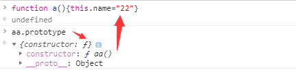

## 对象都是通过函数来创建的

``` js
function fn(){}
var a = new Fn();

var a1 = {a:10,v:10}
var a2 = [1,2]

var obj = new Array();
obj[0] = 1;
obj[1] = 2;

var obj = new Object();
obj.a = 10;
obj.b = 10;

console.log(typeof (Object));  // function
console.log(typeof (Array));  // function

```

## prototype原型

js中 每一个函数都有一个属性叫做prototype，这个prototype的属性值是一个对象[属性集合]，
这个对象集合默认的只有一个叫做constructor的属性，而这个属性指向（的值是）函数自己

::: tip
prototype是函数才会有的属性
:::



原型既然作为对象，属性的集合，不可能就只弄个constructor来玩玩，肯定可以自定义的增加许多属性。
例如这位Object大哥，人家的prototype里面，就有好几个其他属性。

``` js
Object.prototype 谷歌浏览器查看
{
constructor: ƒ Object()
hasOwnProperty: ƒ hasOwnProperty()
isPrototypeOf: ƒ isPrototypeOf()
propertyIsEnumerable: ƒ propertyIsEnumerable()
toLocaleString: ƒ toLocaleString()
toString: ƒ toString()
valueOf: ƒ valueOf()
__defineGetter__: ƒ __defineGetter__()
__defineSetter__: ƒ __defineSetter__()
__lookupGetter__: ƒ __lookupGetter__()
__lookupSetter__: ƒ __lookupSetter__()
get __proto__: ƒ __proto__()
set __proto__: ƒ __proto__()
}
```

你也可以在自己自定义的方法的prototype中新增自己的属性

```js
function a(){}
a.prototype.fh = function(){}
```

调用prototype属性

因为每个对象都有一个隐藏的属性——“__proto__”，这个属性引用了创建这个对象的函数的prototype。

```js 
function a1(){this.name="0000"}
a1.prototype.named = '11111';
var a2 = new a1();

console.log(a1.prototype) // {named: "11111", constructor: ƒ a1()}
console.log(a2) // a1{name: '0000', __proto__: {named: "11111", constructor: ƒ a1()}}

```

即：a2.__proto__ === a1.prototype


复制两个问题

``` js
function Person(name, age) {
    this.name = name;
    this.age = age;
    this.sayHi = function () {
        console.log("hi, I am " + this.name);
    }
 
}
// var nullProto = Object.create(null);
Person.prototype = null;
console.log(Person.prototype); //null
var me = new Person("ErumHuang", 22);
console.log(me.__proto__); //{}  

===============  typeof null  "object"


function Person(name, age) {
    this.name = name;
    this.age = age;
    this.sayHi = function () {
        console.log("hi, I am " + this.name);
    }
 
}
var nullProto = Object.create(null);
Person.prototype = nullProto;
console.log(Person.prototype); //{}
var me = new Person("ErumHuang", 22);
console.log(me.__proto__); //undefined

=========== Object.create(null) 没有继承任何原型方法(没有任何属性)的空对象

```

## 每个对象都有一个隐藏的属性：__proto__（隐式原型）

每个对象都有一个__proto__属性，指向创建该对象的函数的prototype.


