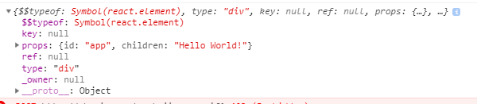
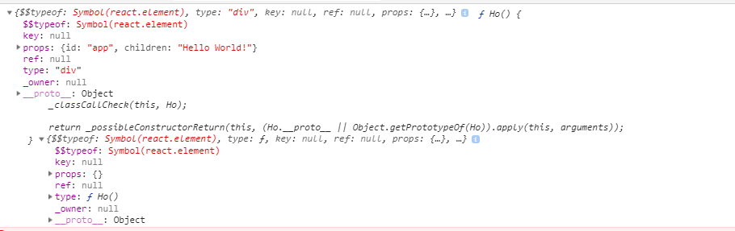
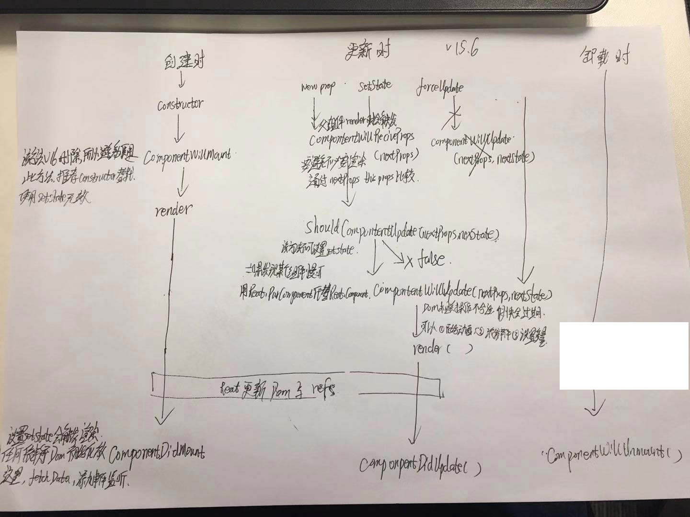
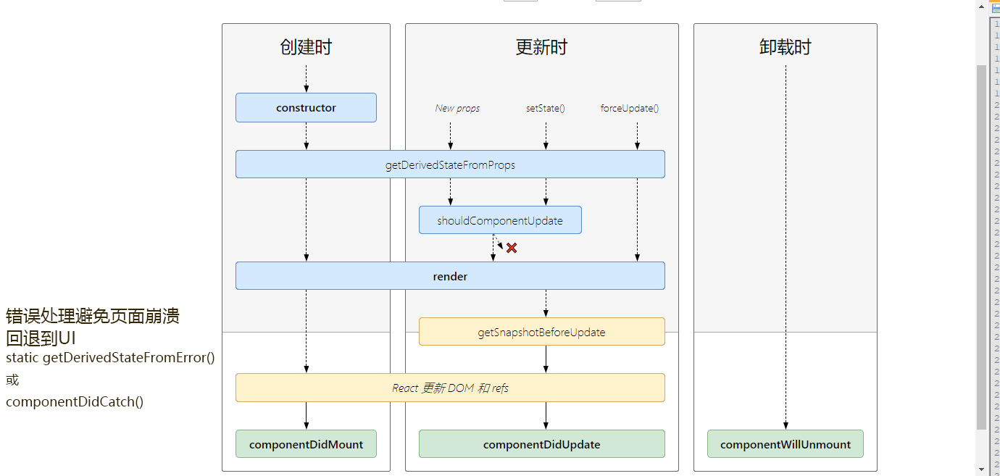

写react组件都会继承react.Component

一个组件类必须要实现一个render方法，这个render方法必须要返回一个jsx元素

注意，必须要用一个外层的jsx元素把所有内容包裹起来。返回并列多个jsx元素不合法

JSX 是 JavaScript 语言的一种语法扩展，你可以在里面写html+js。

jsx只是为 React.createElement(component, props, ...other)方法提供的语法糖

## createElement(type, [config], [childrens])

然后babel就会帮我们调用 React.createElement。 这也是为什么我们就算文件内没用到 React，也需要引入的原因。 


``` jsx

// jsx语法
let app = (<div id='app'>马雄</div>);

// babel转义 
let app = React.createElement('div', {id: 'app'}, '马雄');

console.log(app)

```

createElement 是将jsx转为 ReactElement的函数， 我们把 app 标签打印出来可以看到这个对象就是我们所说的ReactElement。



这里面主要是处理一下 key, ref, defaultProps， 然后将其他的参数和 childrens 放到props对象，最后调用ReactElement。

上面我们写的都是直接写jsx，如果是一个 Class 形式的ReactComponent，其实也一样，只是type从原来的dom标签变成传入的类。

```

import React from 'react';

let app = React.createElement('div', {id: 'app'}, 'Hello World!');

class Ho extends React.Component{
    render(){
        return (
            <div id='app'>
                <h2>gggg</h2>
            </div>
        )
    }
}
console.log(app, Ho, <Ho />)
```



对比上一次的结果，我们发现只有type这里是存在差异的，而这种差异带来的，就是React在渲染元素、组件时候的差异了

组件的定义: 是一个可复用的部件，接收props，并返回元素。

`到这一步，我们只是做了从jsx语法到React Element的转换，但基本上React库的部分就到这里了。`


## ReactDOM.render

在开始之前，我们要先知道一个事情就是：平时我们写React，都要引入多一个 'react-dom'，用 ReactDOM.render来把React生成的ReactElement渲染到 DOM Tree 中。

也就是说我们引入的React负责ReactElement组件相关的东西，渲染层面抽出来交给，ReactDOM、 ReactNative，这种分离这也赋予了React跨终端渲染的能力。


首先我们看一下 `React.render(<T />, document.getElementById('container'))`，这里面的`<T />`首先会被babel调用 React.createElement生成为ReactElement

第一阶段 准备ReactRoot和后续需要的基本属性

ReactRoot

ReactDOM.render 首先会调用 legacyCreateRootFromDOMContainer 创建一个ReactRoot的实例，我们叫他root。


```

const App = (<h2>Hello World!</h2>)
ReactDOM.render(App, document.querySelector('#app'))

或者

class App extends React.Component {
  render(){
    return (
      <div>
        <h2>Hello World!</h2>
      </div>
    )
  }
}
ReactDOM.render(<App />, document.querySelector('#app'))

```

我们知道上面两个例子中ReactDOM.render第一个参数传入的都是ReactElement的“实例”。

如果传入了字符串 提示

ReactDOM.render(): Invalid component element. Instead of passing a string like 'div', pass React.createElement('div') or <div />

查看ReactDOM.js文件，可以看到ReactDOM.render引用ReactMount.js的render方法,如下：

src/renders/dom/ReactDOM.js

ReactDOM.render = ReactMount.render

src/renders/dom/client/Reactmount.js

Reactmount = {
render: => _renderSubtreeIntoContainer
}

当调用ReactDOM.render时，使用TopLevelWrapper对element进行包装，


Render函数在什么情况下会被调用，当且仅当下面三种情况：
组件初始化
组件的props和state发生改变
组件内调用forceUpdate函数


jsx只是为 React.createElement(component, props, ...other)方法提供的语法糖


#### 本文用到的文件

> src/isomorphic/React.js  `React.createElement`入口83行

> src/isomorphic/classic/element/ReactElement.js `ReactElement.createElement()`具体实现 181行

> src/renderers/dom/ReactDOM.js: `ReactDOM.render()`的入口


##### 从JSX到React.createElement()

JSX是在编译的时候由Babel转译成React.createElement()调用的。我们可以使用[https://babeljs.io/repl](https://babeljs.io/repl)查看

``` bash
// jsx语法
import React from 'react'

ReactDOM.render(
  <h1 style={{color:"blue"}}>hello world</h1>,
  document.getElementById("root")
);
```

转义后

``` bash
// babel转义 
"use strict";

import React from 'react'

ReactDOM.render(React.createElement(
  "h1",
  { style: { color: "blue" } },
  "hello world"
), document.getElementById("root"));

```

> React.createElement() - 方法只是做了简单的参数修正，返回一个ReactElement实例对象

	>> 1. React.createElement(type, config, children) 仅仅是 ReactElement.createElement()的一个别名; `src/isomorphic/React.js 22行`

	>> ReactElement.createElement(type, config, children) 做了三件事： `src/isomorphic/classic/element/ReactElement.js 181行`
		1) 把 config里的数据一项一项拷入props, 
		2) 拷贝 children 到 props.children， 
		3) 拷贝 type.defaultProps 到 props

	>> 然后 ReactElement(type,…, props) 会把 type 和 props 原样透传给 ReactElement 的构造函数，并返回新构造的实例. `src/isomorphic/classic/element/ReactElement.js 115行`

这个新构建的ReactElement一会会在ReactMount.instantiateReactComponent() 函数中用到。因为下一步也会构建一个ReactElement我们先把这一步生成的对象命名为ReactElement[1]。
	
#### ReactDom.render() -  开始渲染

> ReactDom.render 执行的是 ReactMount.render `src\renderers\dom\ReactDOM.js 30行`

> 执行 ReactMount._renderSubtreeIntoContainer `src\renderers\dom\client\ReactMount.js 567行`

	>> 检测ReactELement[1]合法性

	>> 检擦container页面容器是否已经被渲染过react组件

	>> 调用renderNewRootComponent渲染（将新组件呈现到dom中）

	>> 调用instantiateReactComponent这是初始化组件的入口函数，

> 执行instantiateReactComponent  `src\renderers\shared\stack\reconciler\instantiateReactComponent.js`
  
  >> 它通过判断node类型来区分不同组件入口（【node类型null】空组件、【node类型对象】DOM标签组件（ReactDOMComponent）或自定义组件（ReactCompositeComponent）、【node类型字符串或数字】文本组件（ReactDOMTextComponent）、【node其他情况】不做处理）
	

	


## 生命周期

组件的生命主要包括3个阶段： 挂载、更新、卸载，React 16开始还添加了错误处理。

::: tip 这个先不考虑

static defaultProps = {}

static propTypes = {}

服务端渲染

:::


###### <center>v15</center>




###### <center>v16</center>




### constructor()

React借用class类的constructor充当初始化钩子。

``` js {4,10}
import React, { Component } from 'react';

class Test extends Component {
	constructor(props) { ******* [1] *******
		super(props);
	}
}

class App extends Component {
    state = {   ******* [2] *******
        name: 'biu',
    };
}
```

#### 题外

为什么可以写成[1] 或者 [2]

+ Class基本语法
	- 实例属性的新写法
		* 实例属性除了在constructor()方法里面定义，也可以直接写在类的最顶层。
		+ 这种新写法的好处是，所有实例属性都定义在类的头部，看上去比较整齐，一眼就能看出这个类有哪些实例属性。
	- 静态属性
		* 静态属性指的是 Class 本身的属性，即Class.propName，而不是定义在实例对象（this）上的属性。

+ Class继承
	- constructor
		* 子类必须在constructor方法中调用super方法，否则新建实例时会报错
			* 这是因为子类自己的this对象，必须先通过父类的构造函数完成塑造，得到与父类同样的实例属性和方法，然后再对其进行加工，加上子类自己的实例属性和方法。如果不调用super方法，子类就得不到this对象。
		- 如果子类没有定义constructor方法，这个方法会被默认添加，代码如下。也就是说，不管有没有显式定义，任何一个子类都有constructor方法。
		- ES5 的继承，实质是先创造子类的实例对象this，然后再将父类的方法添加到this上面（[Parent.apply(this)、.call()](./js-this-call.html)）。
		- ES6 的继承机制完全不同，实质是先将父类实例对象的属性和方法，加到this上面（所以必须先调用super方法），然后再用子类的构造函数修改this。


### componentWillMount()

实例之后，虚拟dom构建真实dom之前触发的

::: tip

初始化this.state应该在constructor生命周期钩子中完成，请求数据应该在componentDidMount生命周期钩子中完成，所以它不仅被废弃了，连继任者都没有。

:::

##### static getDerivedStateFromProps(props, state)

字面意思 从props中获取数据映射到state

首先，这是一个静态方法生命周期钩子。

也就是说，定义的时候得在方法前加一个static关键字，或者直接挂载到class类上。

这个函数不能通过this访问到class属性，而是通过参数提供的nextprops、prevstate来进行判断，根据新传入的props来映射到state，如果不需要影响的你的state，必须返回一个null值

``` bash

static getDerivedStateFromProps(nextProps, prevState){
	const { type} = nextProps;
	// 当传入的type发生变化时候更新state
	if(type !== prevState.type){
		return {
			type
		}
	}
	// 否则，对于state不进行任何操作
	return null;
}

```

这个生命周期函数威力替代`componentWillReceiveProps`

### render()

作为一个组件，最核心的功能就是把元素挂载到DOM上，所以render生命周期钩子是一定会用到的。

return 一个React元素（描述组件，即UI），不负责组件实际渲染工作，之后由React自身根据此元素去渲染出页面DOM

### componentDidMount()

这是组件挂载到DOM之后的生命周期钩子。

这可能是除了render之外最重要的生命周期钩子，因为这时候组件的各方面都准备就绪，天地任你闯

componentDidMount是通过一个队列来维护的，因为队列是先进先出的.而最里层的组件是最先执行！ transaction

这里有涉及到了`事务和队列` 以后再说

### componentWillReceiveProps(nextProps)

`componentWillReceiveProps`生命周期钩子只有一个参数，更新后的props。

该声明周期函数可能在两种情况下被触发：

> 组件接收到了新的属性。

> 组件没有收到新的属性，但是由于父组件重新渲染导致当前组件也被重新渲染。

初始化时并不会触发该生命周期钩子。

所以在此方法中根据nextProps和this.props来查明重传的props是否改变，如果改变了要执行啥，比如根据新的props调用this.setState出发当前组件的重新render

###### 延伸 关于重复渲染的问题

``` js
// 第一种 class B extends React.PureComponent{

class B extends React.Component{
	// 第二种
	/*
		state = {
			p: ''
		}
		componentWillReceiveProps(nextProps){
			this.setState({
				p: nextProps.p
			})
		}
		shouldComponentUpdate(nextProps, nextState){
			// nextSTate 返回当前组件state
			if(nextProps.p === nextSTate.p){
				return false;
			}else{
				return true;
			}
		}
	*/
	
	render(){
		return (
			<div>www</div>
		)
	}
}

class A extend React.Component{
	state = {
		p: '111'
	}
	vv(){
		this.setState({
			p: '111'
		})
	}
	render(){
		return [
			<div onClick = {() => this.vv()}>onclick</div>
			<B p={this.state.p}/>
		]
	}
}

```

我们点击 父组件的onclick时候，不管p传过去的值修没修改，子组件都会render

解决方法如上

### shouldComponentUpdate(nextProps, nextState)

这个生命周期钩子是一个开关，判断是否需要更新，主要用来优化性能。

有一个例外，如果开发者调用this.forceUpdate强制更新，React组件会无视这个钩子。

此方法通过比较nextProps，nextState及当前组件的this.props，this.state，返回true时当前组件将继续执行更新过程，返回false则当前组件更新停止，以此可用来减少组件的不必要渲染，优化组件性能。

### componentWillUpdate(nextProps, nextState)

`shouldComponentUpdate`生命周期钩子返回true，或者调用`this.forceUpdate`之后，会立即执行该生命周期钩子。

要特别注意，`componentWillUpdate`生命周期钩子每次更新前都会执行，所以在这里调用`this.setState`非常危险，有可能会没完没了。

### getSnapshotBeforeUpdate(prevProps, prevState)

顾名思义，保存状态快照用的。

它会在组件即将挂载时调用，注意，是即将挂载。它甚至调用的比render还晚，由此可见render并没有完成挂载操作，而是进行构建抽象UI的工作。getSnapshotBeforeUpdate执行完就会立即调用componentDidUpdate生命周期钩子。

### componentDidUpdate(nextProps, nextState, snapshot)

这是组件更新之后触发的生命周期钩子。

搭配getSnapshotBeforeUpdate生命周期钩子使用的时候，第三个参数是getSnapshotBeforeUpdate的返回值。

同样的，componentDidUpdate生命周期钩子每次更新后都会执行，所以在这里调用this.setState也非常危险，有可能会没完没了。

##### componentWillUnmount()

当组件需要从DOM中移除时, 即会触发这个钩子函数.

React的最佳实践是，组件中用到的事件监听器、订阅器、定时器都要在这里销毁。

当然我说的事件监听器指的是这种：

``` js
componentDidMount() {
    document.addEventListener('click', () => {});
}
```

因为下面这种React会自动销毁，不劳烦开发者了。

``` js
render(
	return (
    	<button onClick={this.handle}>click</button>
    );
)
```

### componentDidCatch(error, info)

它主要用来捕获错误并进行相应处理，所以它的用法也比较特殊。

定制一个只有componentDidCatch生命周期钩子的ErrorBoundary组件，它只做一件事：如果捕获到错误，则显示错误提示，如果没有捕获到错误，则显示子组件。

将需要捕获错误的组件作为ErrorBoundary的子组件渲染，一旦子组件抛出错误，整个应用依然不会崩溃，而是被ErrorBoundary捕获。

