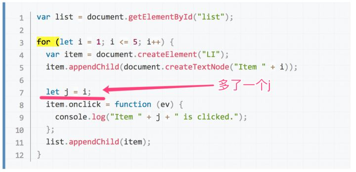
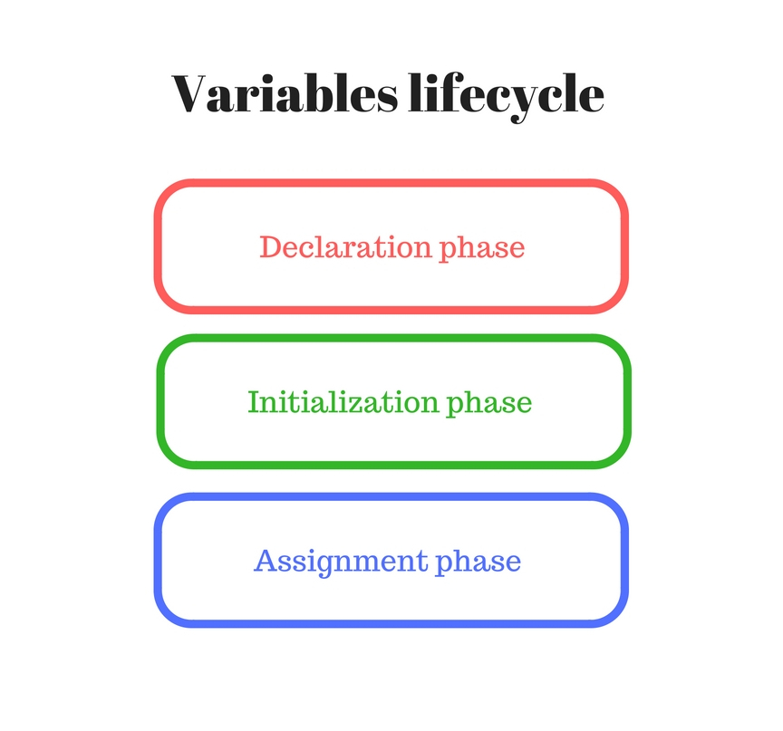
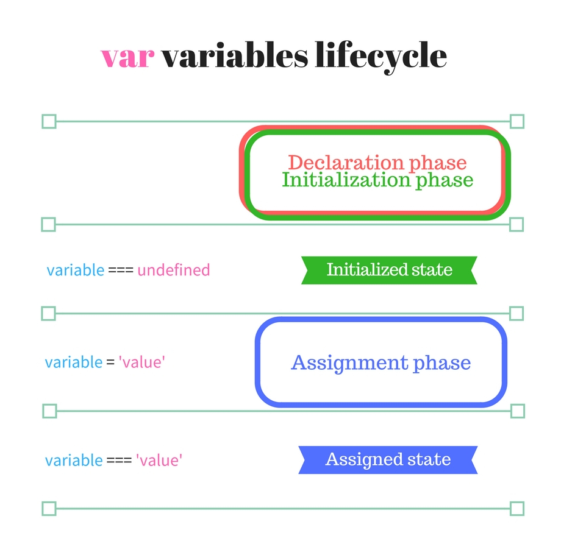
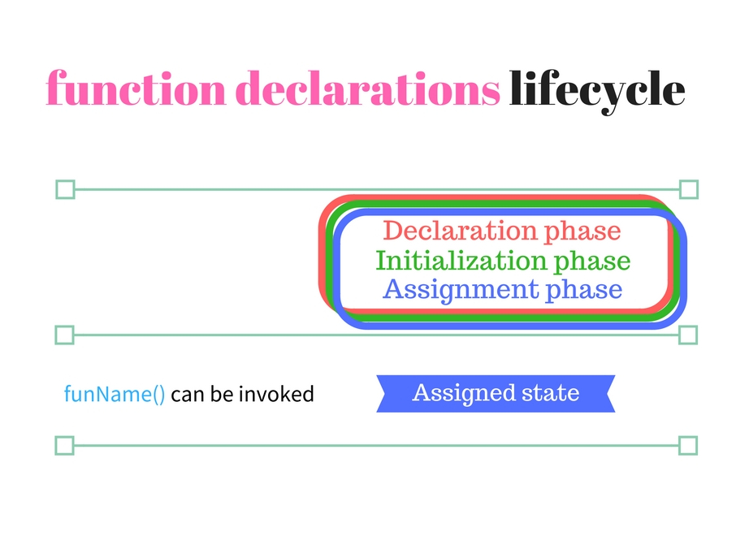
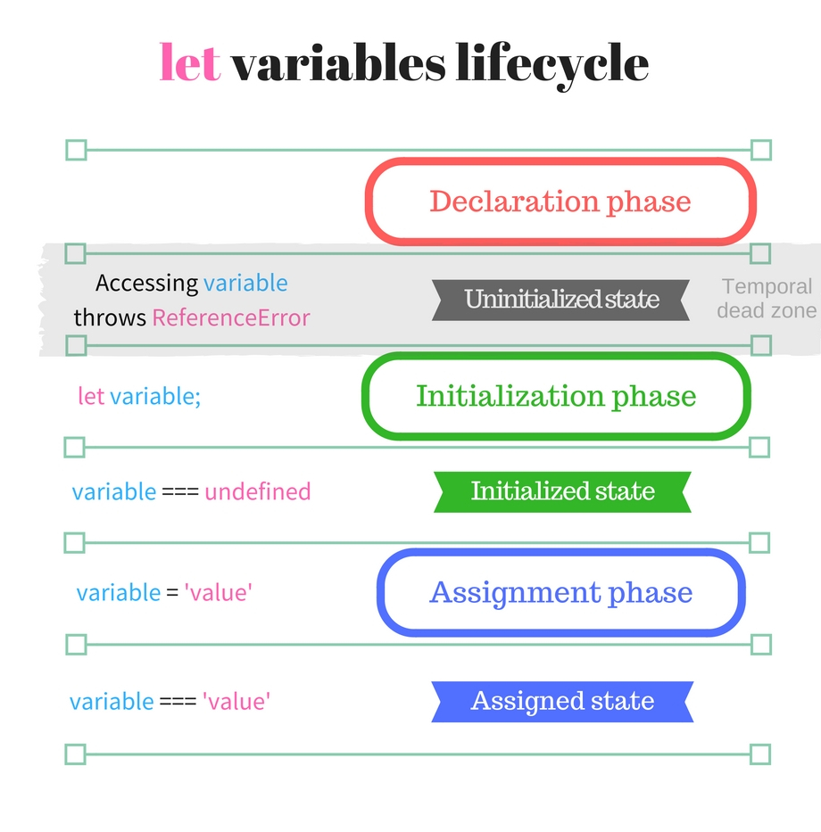

## 初识let

MDN:

let 声明的变量的作用域是块级的；
let 不能重复声明已存在的变量；
let 有暂时死区，不会被提升。

#### 第一次质疑

我第一次质疑我的理解是在遇到 for 循环的时候，代码如下。

``` js
// 代码段1
var liList = document.querySelectorAll('li') // 共5个li
for( var i=0; i<liList.length; i++){
  liList[i].onclick = function(){
    console.log(i)
  }
}
```

大家都知道依次点击 li 会打印出 5 个 5。如果把 var i 改成 let i，就会分别打印出 0、1、2、3、4：

``` js
// 代码段2
var liList = document.querySelectorAll('li') // 共5个li
for( let i=0; i<liList.length; i++){
  liList[i].onclick = function(){
    console.log(i)
  }
}
```

然而，用我之前的知识来理解这个代码是不能自圆其说的。因为代码中依然只声明了一个 i，在 for 循环结束后，i 的值还是会变成 5 才对。

于是我去看 MDN 的例子，发现鸡贼的 MDN 巧妙地避开了这个问题，它的例子是这样的：



你看 MDN 的例子，在每次循环的时候用 let j 保留的 i 的值，所以在 i 变化的时候，j 并不会变化。而console.log 的是 j，所以不会出现 5 个 5。

为什么 MDN 要故意声明一个 j 呢，为什么不直接用 i 呢？

我猜测 MDN 为了简化知识，隐瞒了什么。


::: tip 我说一下我的理解：
for( let i = 0; i< 5; i++) 这句话的圆括号之间，有一个隐藏的作用域
for( let i = 0; i< 5; i++) { 循环体 } 在每次执行循环体之前，JS 引擎会把 i 在循环体的上下文中重新声明及初始化一次。
:::

也就是说上面的代码段2可以近似近似近似地理解为

``` js
// 代码段3
var liList = document.querySelectorAll('li') // 共5个li
for( let i=0; i<liList.length; i++){
  let i = 隐藏作用域中的i // 看这里看这里看这里
  liList[i].onclick = function(){
    console.log(i)
  }
}
```

那样的话，5 次循环，就会有 5 个不同的 i，console.log 出来的 i 当然也是不同的值。

再加上隐藏作用域里的 i，一共有 6 个 i。

这就是 MDN 加那句 let j = i 的原因：方便新人理解。

总得来说就是 let/const 在与 for 一起用时，会有一个 perIterationBindings 的概念（一种语法糖）。

从此之后，我就开始怀疑我对 let 的所有理解了。

#### 第二次质疑

let 到底有没有提升


::: tip
In JavaScript, all binding declarations are instantiated when control flow enters the scope in which they appear. 
Legacy var and function declarations allow access to those bindings before the actual declaration, 
with a "value" of undefined. That legacy behavior is known as "hoisting". 
let and const binding declarations are also instantiated when control flow enters the scope in which they appear, 
with access prevented until the actual declaration is reached; this is called the Temporal Dead Zone. 
The TDZ exists to prevent the sort of bugs that legacy hoisting can create.
:::

let 声明一个块级作用域的本地变量
``` bash
function varTest() {
  var x = 1; // 同样的变量!
  if (true) {
    var x = 2;  // 同样的变量!
    console.log(x);  // 2
  }
  console.log(x);  // 2
}

function letTest() {
  let x = 1; // 不同的变量
  if (true) {
    let x = 2;  // 不同的变量
    console.log(x);  // 2
  }
  console.log(x);  // 1
}
```

let 重复定义一个变量将引起 TypeError
``` bash
if (x) {
  let foo;
  let foo; // TypeError thrown.
}
```

let  声明不会被提升到当前执行上下文的顶部
``` bash
function do_something() {
  console.log(bar); // undefined
  console.log(foo); // ReferenceError: foo is not defined
  var bar = 1;
  let foo = 2;
}
```


## 提升

提升是将变量或函数，移动到作用域顶部的过程，通常用于变量语句var和函数声明function fun() {...}。

`提升`并不是描述let变量初始化和可用性的正确术语。


### 容易出错的 var 提升

以前（现在）我会在当前作用域范围内的任何地方看到变量var varname和函数function funName() {...}声明的奇怪做法：

``` js
// var hoisting
num;     // => undefined  
var num;  
num = 10;  
num;     // => 10  
// function hoisting
getPi;   // => function getPi() {...}  
getPi(); // => 3.14  
function getPi() {  
  return 3.14;
}

```

num在声明之前访问该变量var num，因此将其计算为undefined。
该函数function getPi() {...}在文件末尾定义。但是，该函数可以在声明之前调用getPi()，因为它被提升到范围的顶部。

这是经典的变量提升 Hoisting

事实证明，先使用后声明变量或函数可能会造成混乱。假设您在滚动查看一个大文件，突然看到一个未声明的变量...它是怎么出现在这里，又是在哪里定义的？
当然一个经验丰富的JavaScript开发者不会用这种方式写代码，但是在成千上万的JavaScript GitHub仓库中很有可能会面对这样的代码。
即使看着上面给出的代码示例，也很难理解代码中的声明流程。
自然地，首先声明或描述一个未知的词语，然后才使用它来编写短语。let鼓励遵循这种方式来使用变量


### 在底层：变量生命周期


当引擎（V8）使用变量时，它们的生命周期包括以下阶段：
声明阶段正在范围内注册变量。
初始化阶段是分配内存并为范围中的变量创建绑定。在此步骤中，变量将自动初始化为undefined。
赋值阶段是为初始化变量赋值。

当变量通过声明阶段时，它具有单一化状态 undefined，但未达到初始化。



请注意，就变量生命周期而言，声明阶段是一般与变量声明不同的术语。
简而言之，引擎在3个阶段处理变量声明：声明阶段，初始化阶段和分配阶段。


### var 的变量生命周期

让我们来看一下引擎是如何处理var变量的：




``` js
function multiplyByTen(number) {  
  console.log(ten); // => undefined
  var ten;
  ten = 10;
  console.log(ten); // => 10
  return number * ten;
}
multiplyByTen(4); // => 40  
```

当JavaScript开始执行multipleByTen(4)并进入函数作用域时，变量ten在第一个语句之前传递声明和初始化步骤。
因此，当console.log(ten)记录它时undefined。
该语句ten = 10指定初始值。分配后，该行console.log(ten)正确记录10值。

### Function 的变量生命周期

声明、初始化和分配阶段在封闭函数范围的开头（仅一步骤）同时发生。
funName()可以在范围的任何位置调用，而不取决于声明语句的位置（甚至可以在末尾）。



``` js
function sumArray(array) {  
  return array.reduce(sum);
  function sum(a, b) {
    return a + b;
  }
}
sumArray([5, 10, 8]); // => 23  
```

当JavaScript执行时sumArray([5, 10, 8])，它进入sumArray函数范围。
在此范围内，在任何语句执行之前，sum通过所有3个阶段：声明，初始化和赋值。
这种方式甚至array.reduce(sum)可以sum在其声明声明之前使用function sum(a, b) {...}。

### let 变量生命周期

let变量的处理方式不同于var。主要区别在于声明和初始化阶段是分开的。



``` js
let condition = true;  
if (condition) {  
  // console.log(number); // => Throws ReferenceError
  let number;
  console.log(number); // => undefined
  number = 5;
  console.log(number); // => 5
}
```

当JavaScript进入if (condition) {...}块范围时，number立即通过声明阶段。
因为number未初始化状态并且处于暂时死区，所以尝试访问变量会抛出ReferenceError: number is not defined。
稍后该语句let number进行初始化。现在可以访问变量，但它的值是undefined。
赋值语句number = 5当然是分配阶段。

const和class类型具有相同的生命周期let，除了赋值只能发生一次。

在 js种所有的声明`var`，`let`，`const`，`function`，`function*`，`class` 都存在提升 hoisted

var/ function/ function*声明和let/ const/ class声明之间的区别是初始化


## 结论

使用 var 声明变量容易出错
let 使用改进的算法来声明变量，还有块作用域。
由于let声明和初始化阶段是分离的，因此提升对let变量无效（包括const和class）。
在初始化之前，变量处于临时死区(TDZ)并且不可访问。

## 思考

1、for(let = (setTimeout(()=>{console.log(i)}, 2333), 0); i<2;i++){} i会输出什么

解析

::: tip for 语法
for (语句 1; 语句 2; 语句 3) {
    被执行的代码块
}
语句 1（代码块）开始前执行；
语句 2 定义运行循环（代码块）的条件；
语句 3 在循环（代码块）已被执行之后执行；
:::

执行的顺序为：
1.第一次循环，即初始化循环。
首先执行语句1（一般为初始化语句），再执行语句2（一般为条件判断语句），判断语句1是否符合语句2的条件，如果符合，则执行代码块，否则，停止执行，最后执行语句3。
2.其他循环：
首先判断前一次语句3的执行结果是否符合执行语句2的条件，如果符合，继续执行代码块，否则停止执行，最后执行语句3。如此往复，直到前一次语句3的执行结果不满足符合执行语句2的条件。

总的来说，执行顺序是一致的，先执行条件判断（语句2），再执行代码块，最后执行语句3。如此往复，区别在于条件判断的对象，在第一次判断时，是执行语句1，初始化的对象，后续的判断对象是执行语句3的结果。


::: tip 逗号表达式
逗号表达式，因为原题目中就有使用逗号表达式let i = (setTimeout(()=>console.log(i), 2333), 0);。

逗号表达式的一般形式是：表达式1,表达式2,表达式3......表达式n。
逗号表达式的求解过程是：先计算表达式1的值，再计算表达式2的值，......一直计算到表达式n的值。
最后整个逗号表达式的值是表达式n的值。 
:::

``` js
x=8*2, x*4  // 整个表达式的值为64，x的值为16

(x=8*2, x*4), x*2 // 整个表达式的值为32，x的值为16

x=(z=5, 5*2) // 整个表达式为赋值表达式，它的值为10，z的值为5，x的值为10

x=z=5, 5*2 // 整个表达式为逗号表达式，它的值为10，x和z的值都为5
```

``` js
for (var i = 0; i < 2; i++) {
    console.log(i);
}

// 打印答案输出 0 1。

for (var i = 0; i < 2; i++) {
    setTimeout(() => console.log(i));
}

// 打印 2, 2

```

``` js
for(var i = 0; i < 2; i++){
  setTimeout(()=>console.log(i))
}
//由于是var，我们现在改写这个for循环，他相等于如下：
var i; // var变量提升
for(i = 0; i < 2; i++){
  setTimeout(()=>console.log(i))
}

//所以，毫无疑问这里的i打印出来的都是2（setTimeout异步会在i循环以后执行）

```

从这个例子可以看出，let变量在for循环中，都会被重新赋值一个新的值，
因此上面代码中，for循环中获取的i值都是一个新的

``` js
for(let i = 0; i < 2; i++){
  setTimeout(()=>console.log(i))
}
//js内部魔法的神奇之处，他会隐式帮你新建一个变量j，于是for循环将会变成如下：
for(let i = 0; i < 2; i++){
  let j = i; // 所以for中的i其实都是被js引擎挟持了的i，不是我们看到的i
  setTimeout(()=>console.log(j))
}
//根据let的块级作用域，setTimeout每次打印出来的j都是当前{}作用域下的j

```

人觉得，这个是let的块级作用域相关，每次循环的时候的i都是块级作用域，只对本次循环可见，下次循环不可见。

所以，我们以后如果需要再for循环中获取循环项的时候，可以不用立即执行函数来实现了，可以改为let了。


根据答案结果我们来倒推一下，首先for循环里第一句话let i = (setTimeout(()=>console.log(i), 2333), 0);会初始化一个 i 且这个 i 是单独存在一个作用域的，这个 i 只代表初始值。当第一句执行结束时这个 i 就封存了，然后在第二句话之前js内部魔法会自动记下这个 i 的值，于是乎for就将改写成如下这个样子：

``` js
for(
  let i = (setTimeout(()=>console.log(i), 2333), 0);
  let j = i;
  j < 2;
  j++
){
  
}

```

也就是说执行到第二句话时，已经是新的一个 i(也就是上述代码的j) 了，
从而得出for循环内第一句话是一个作用域，后面两句话又在另一个作用域内。
我们也就可以把i < 2看成for循环的入口，i++看成for循环的出口，每次都是不停地在这个之间循环。

::: tip 回答问题：
for循环的第一个语句是初始化，这个时候的i就是原本的i，初始化为0，
后面的i都是每次循环新生成的i，与初始化的i无关，所以到2333毫秒以后，i的值任然为0，
因此打印出来的i就是0了。
:::

[https://www.youtube.com/watch?v=Nzokr6Boeaw&list=PLNYkxOF6rcIAKIQFsNbV0JDws_G_bnNo9](https://www.youtube.com/watch?v=Nzokr6Boeaw&list=PLNYkxOF6rcIAKIQFsNbV0JDws_G_bnNo9)
[https://zhuanlan.zhihu.com/p/28140450](https://zhuanlan.zhihu.com/p/28140450)
[https://dmitripavlutin.com/variables-lifecycle-and-why-let-is-not-hoisted/](https://dmitripavlutin.com/variables-lifecycle-and-why-let-is-not-hoisted/)