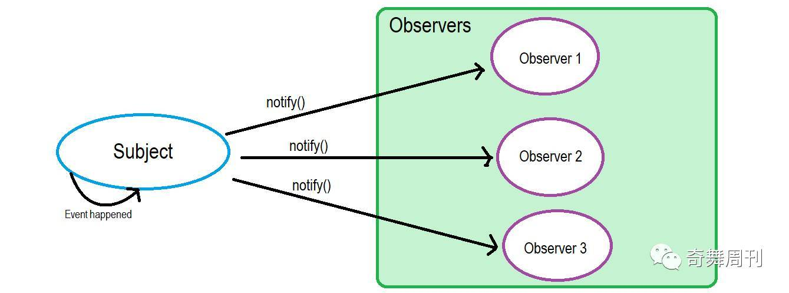
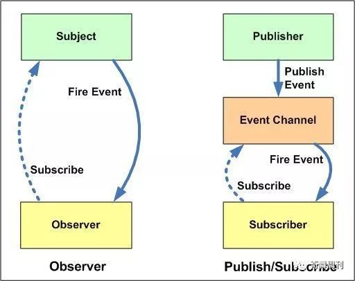

---
---


http://zhouweicsu.github.io/blog/2017/03/07/vue-2-0-reactivity/


我们来看一下构造函数

``` js
function Vue(options){
	this._init(options)
}
```


当我们new Vue({})的时候，执行的是_init()方法，这个方法是在initMixin(Vue)这里，
执行_init方法会触发initState(this 当前实例),在这个inistate方法里面会判断如果存在data调用initData(this 当前实例),
在这个initData中有一个while循环，检测关键字(methods、proxy、$、_),

`这里有一个知识点就是charCodeAt(i)指定的位置的字符的 Unicode 编码; String.fromCharCode()将 Unicode 编码转为字符。`

在initData中 执行observe(data, true) 检测data数据,为每个值创建一个观察者实例

我们来看一下 
``` js
function observe(value, asRootData){
	if(如果这个值被观察，则返回)
	{ob = value.__ob__;}
	else if(如果没有被观察，则实例化Observer)
	{ob = new Observer(value);}
}
```

当我们 new Observer(value)

``` js
function Observer(value){
	//  [this.dep = new Dep();](./js-vue-observer/#Dep)
	// 这里进行了判断 数组与对象（默认必须是对象 因为data:{}）
	if(数组)
	{this.observeArray(value);}
	else if(对象)
	{this.walk(value);}
}
// 如果是数组 开始遍历数组的每个值，然后在进行__ob__观察
Observer.prototype.observeArray = function observeArray (items) {
  for (var i = 0, l = items.length; i < l; i++) {
    observe(items[i]);
  }
};
// 如果是对象
Observer.prototype.walk = function walk (obj) {

  var keys = Object.keys(obj);
  console.log(keys,'==3')
  for (var i = 0; i < keys.length; i++) {
    defineReactive(obj, keys[i]);
  }
};

function defineReactive (){
 // 首先他会把data里面所有值变成可观察的，完成以后
	// 遍历data中所有属性并使用 Object.defineProperty 把这些属性全部转为 getter/setter
	// 这样我们就可以实现数据监控到
}
```

## 观察者模式

观察者模式在软件设计中是一个对象，维护一个依赖列表，当任何状态发生改变自动通知它们。

我们假设你正在找一份软件工程师的工作，对“香蕉公司”很感兴趣。所以你联系了他们的HR，给了他你的联系电话。
他保证如果有任何职位空缺都会通知你。这里还有几个候选人也你一样很感兴趣,
所以职位空缺大家都会知道。如果你回应了公司的通知，公司就会联系你面试.

::: tip 所以，以上和“观察者模式”有什么关系呢？
这里的“香蕉公司”就是Subject[发布者]，用来维护Observers（和你一样的候选人）[观察者]，为某些event（比如职位空缺）[动作]来通知（notify）观察者(observer)
:::

如下图：



## 发布-订阅模式

跟观察者很类似 发布者(publishers) -> 订阅者(Subscriber)


在发布-订阅模式，消息的发送方，叫做发布者（publishers），消息不会直接发送给特定的接收者（订阅者）。他们中间有一个媒介(就当它是中介吧);
意思就是发布者和订阅者不知道对方的存在。需要一个第三方组件，叫做信息中介，它将订阅者和发布者串联起来，它过滤和分配所有输入的消息。
换句话说，发布-订阅模式用来处理不同系统组件的信息交流，即使这些组件不知道对方的存在。

## 区别



1\ 在观察者模式中，观察者是知道Subject的，Subject一直保持对观察者进行记录。然而，在发布订阅模式中，发布者和订阅者不知道对方的存在。它们只有通过消息代理进行通信。
2\ 在发布订阅模式中，组件是松散耦合的，正好和观察者模式相反。
3\ 观察者模式大多数时候是同步的，比如当事件触发，Subject就会去调用观察者的方法。而发布-订阅模式大多数时候是异步的（使用消息队列）。
4\ 观察者模式需要在单个应用程序地址空间中实现，而发布-订阅更像交叉应用模式。


而 Object.defineProperty 里面的set就是发布者


## dep

在给每个属性值创建 观察者实例(ob)的时候，发现一个依赖 dep 属性

``` js
var Observer = function Observer (value) {
	this.value = value;
	this.dep = new Dep();// <---- 这里
	this.vmCount = 0;
	def(value, '__ob__', this);
	if (Array.isArray(value)) {
		var augment = hasProto
		  ? protoAugment
		  : copyAugment;
		augment(value, arrayMethods, arrayKeys);
		this.observeArray(value);
	} else {
		this.walk(value);
	}
};

function defineReactive (
  obj,
  key,
  val,
  customSetter,
  shallow
) {
	var dep = new Dep();

	// ... 省略 ...
	var childOb = !shallow && observe(val);
	Object.defineProperty(obj, key, {
		enumerable: true,
		configurable: true,
		get: function reactiveGetter () {
		  var value = getter ? getter.call(obj) : val;
		  if (Dep.target) {
			dep.depend();
			if (childOb) {
			  childOb.dep.depend();
			  if (Array.isArray(value)) {
				dependArray(value);
			  }
			}
		  }
		  return value
		},
		set: function reactiveSetter (newVal) {
		  var value = getter ? getter.call(obj) : val;
		  /* eslint-disable no-self-compare */
		  if (newVal === value || (newVal !== newVal && value !== value)) {
			return
		  }
		  /* eslint-enable no-self-compare */
		  if ("development" !== 'production' && customSetter) {
			customSetter();
		  }
		  if (setter) {
			setter.call(obj, newVal);
		  } else {
			val = newVal;
		  }
		  childOb = !shallow && observe(newVal);
		  dep.notify();
		}
    });
}
```

