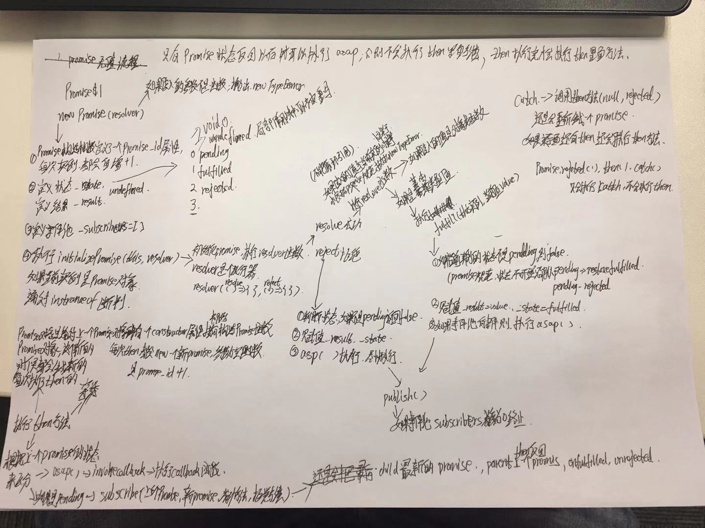

### 面试常题

+ 了解Promise吗
  - Promise单词翻译：许诺，希望，期望
  - Promise是一个对象
  - Promise/A+ 表示异步操作的最终结果（完成/失败）
  - ECMAscript 规范定义为延时或异步计算最终结果的占位符
  - 有三种状态：`fulfilled`、`rejected`、`pending`，每个状态只能改变一次（不可逆的）

+ Promise解决了什么？
  - 代码简洁
    + Promise的链式调用解决了 函数无止境地狱回调( 嵌套调用)
    + 可以帮助您自然地处理错误，简化了`try{}catch(e){}`
    + 处理多个异步请求并发
  - 在nodejs与浏览器中都可以使用
  - 是异步编程的一种解决方案：Promise.all、Promise.race等

+ Promise 事件循环、手写Promise
  - 单独下面说


### Promise内部结构

#### Promise构造函数

constructor[构造方法] 是Promise构造函数的内部对象和全局对象的Promise属性的初始值
只能当作构造函数调用，他创建并初始化一个新的Promise对象；否则抛出异常

+ Promise ( executor ) 
  - executor 如果不是函数，抛出类型错误 `Uncaught TypeError: Promise resolver undefined is not a function`
  - 定义promise属性[[PromiseState]]设置值为pending
  - 执行executor
  - 返回promise

#### Promise参数-executor

executor是带有 resolve 和 reject 两个参数的函数 。Promise构造函数执行时立即调用executor 函数， resolve 和 reject 两个函数作为参数传递给executor（executor 函数在Promise构造函数返回所建promise实例对象前被调用）。resolve 和 reject 函数被调用时，分别将promise的状态改为fulfilled（完成）或rejected（失败）。executor 内部通常会执行一些异步操作，一旦异步操作执行完毕(可能成功/失败)，要么调用resolve函数来将promise状态改成fulfilled，要么调用reject 函数将promise的状态改为rejected。如果在executor函数中抛出一个错误，那么该promise 状态为rejected。executor函数的返回值被忽略。


#### Promise的方法

+ Promise.all(iterable)
  - 这个方法返回一个新的promise对象，该promise对象在iterable参数对象里所有的promise对象都成功的时候才会触发成功，一旦有任何一个iterable里面的promise对象失败则立即触发该promise对象的失败。这个新的promise对象在触发成功状态以后，会把一个包含iterable里所有promise返回值的数组作为成功回调的返回值，顺序跟iterable的顺序保持一致；如果这个新的promise对象触发了失败状态，它会把iterable里第一个触发失败的promise对象的错误信息作为它的失败错误信息。Promise.all方法常被用于处理多个promise对象的状态集合
+ Promise.prototype
  - 返回被创建的实例函数.  默认为 Promise 函数.
+ Promise.race(iterable)
  - 当iterable参数里的任意一个子promise被成功或失败后，父promise马上也会用子promise的成功返回值或失败详情作为参数调用父promise绑定的相应句柄，并返回该promise对象。
+ Promise.reject
  - 返回一个状态为失败的Promise对象，并将给定的失败信息传递给对应的处理方法
+ Promise.resolve
  - 返回一个状态由给定value决定的Promise对象。如果该值是thenable(即，带有then方法的对象)，返回的Promise对象的最终状态由then方法执行决定；否则的话(该value为空，基本类型或者不带then方法的对象),返回的Promise对象状态为fulfilled，并且将该value传递给对应的then方法。通常而言，如果你不知道一个值是否是Promise对象，使用Promise.resolve(value) 来返回一个Promise对象,这样就能将该value以Promise对象形式使用

#### Promise原型对象的属性

+ Promise.prototype.catch ( onRejected )
  - 添加一个拒绝(rejection) 回调到当前 promise, 返回一个新的promise。当这个回调函数被调用，新 promise 将以它的返回值来resolve，否则如果当前promise 进入fulfilled状态，则以当前promise的完成结果作为新promise的完成结果.

+ Promise.prototype.constructor
  - 初始值是Promise构造函数

+ Promise.prototype.finally(onFinally)
  - 添加一个事件处理回调于当前promise对象，并且在原promise对象解析完毕后，返回一个新的promise对象。回调会在当前promise运行完毕后被调用，无论当前promise的状态是完成(fulfilled)还是失败(rejected)

+ Promise.prototype.then(onfulfilled, onrejected)
  - 检测当前promise是否是Promise实例(promise instanceof Promise)/IsPromise(promise),如果不是 抛出 throw TypeError
  - 通过new运算符，在通过Promise构造函数的constructor(构造方法),创建一个新的promise对象，
  - 执行 PerformPromiseThen
    + enqueuejob
    + 添加解决(fulfillment)和拒绝(rejection)回调到当前 promise,
  - 返回新的promise对象

+ Promise.prototype[@@toStringTag]
  - 不可写、不可枚举、不可配置
  - 是一个内置 symbol ，值：promise
  - Object.prototype.toString.call(new Promise(() =>{})) ===> '[object promise]'

#### Promise的实例属性

Promise实例是从Promise原型对象继承属性的普通对象

|属性名|描述|
|:---|:---|
|[[PromiseState]]|promise状态；string类型；它控制Promise对其then方法的传入调用的响应方式；值：pending、fulfilled、rejected|
|[[PromiseResult]]|promise结果；fulfilled或rejected的结果值，pending的结果默认undefined|
|[[PromiseFulfillReactions]]|promise fulfill的反应；promise状态变成fulfilled的记录列表|
|[[PromiseRejectReactions]]|promise rejected的反应；状态变成rejected的记录列表|


::: tip ???
不管是Promise原型对象上的方法还是Promise函数对象上的方法 ，它们的执行结果都将返回一个Promise对象
:::

#### 手写 Promise.race 

``` js
// 返回第一个成功或者失败的promise对象
function race (arr){
  let That = this;
  if(Array.isArray(arr)){
    return new That(function(resolve, reject){
      let length = arr.length;
      for(let i =0; i<length;i++){
        That.resolve(arr[i]).then(resolve, reject)
      }
    })
  }else{
    return new That(function(null, reject){
      return reject(new TypeError('必须是数组'))
    })
  }
}
```

### promise类库

``` js

(function (global, factory) {
	typeof exports === 'object' && typeof module !== 'undefined' ? module.exports = factory() :
	typeof define === 'function' && define.amd ? define(factory) :
	(global.ES6Promise = factory());
}(this, (function () { 'use strict';

// 判断是否是函数或者对象 除null
function objectOrFunction(x) {
  var type = typeof x;
  return x !== null && (type === 'object' || type === 'function');
}

// 判断是否是函数
function isFunction(x) {
  return typeof x === 'function';
}

var _isArray = void 0;

if (Array.isArray) {
  _isArray = Array.isArray;
} else {
  _isArray = function (x) {
    return Object.prototype.toString.call(x) === '[object Array]';
  };
}
// 判断是不是数组
var isArray = _isArray;

var len = 0;
var vertxNext = void 0;
var customSchedulerFn = void 0;
//==== https://github.com/kriskowal/asap/blob/master/browser-raw.js
var asap = function asap(callback, arg) {
  queue[len] = callback;
  queue[len + 1] = arg;
  len += 2;
  if (len === 2) {
    // If len is 2, that means that we need to schedule an async flush.
    // If additional callbacks are queued before the queue is flushed, they
    // will be processed by this flush that we are scheduling.
    if (customSchedulerFn) {
      customSchedulerFn(flush);
    } else {
      scheduleFlush();
    }
  }
};

function setScheduler(scheduleFn) {
  customSchedulerFn = scheduleFn;
}

function setAsap(asapFn) {
  asap = asapFn;
}

var browserWindow = typeof window !== 'undefined' ? window : undefined;
var browserGlobal = browserWindow || {};
var BrowserMutationObserver = browserGlobal.MutationObserver || browserGlobal.WebKitMutationObserver;
var isNode = typeof self === 'undefined' && typeof process !== 'undefined' && {}.toString.call(process) === '[object process]';

// test for web worker but not in IE10
var isWorker = typeof Uint8ClampedArray !== 'undefined' && typeof importScripts !== 'undefined' && typeof MessageChannel !== 'undefined';

// node
function useNextTick() {
  // node version 0.10.x displays a deprecation warning when nextTick is used recursively
  // see https://github.com/cujojs/when/issues/410 for details
  return function () {
    return process.nextTick(flush);
  };
}

// vertx
function useVertxTimer() {
  if (typeof vertxNext !== 'undefined') {
    return function () {
      vertxNext(flush);
    };
  }

  return useSetTimeout();
}

function useMutationObserver() {
  var iterations = 0;
  var observer = new BrowserMutationObserver(flush);
  var node = document.createTextNode('');
  observer.observe(node, { characterData: true });

  return function () {
    node.data = iterations = ++iterations % 2;
  };
}

// web worker
function useMessageChannel() {
  var channel = new MessageChannel();
  channel.port1.onmessage = flush;
  return function () {
    return channel.port2.postMessage(0);
  };
}

function useSetTimeout() {
  // Store setTimeout reference so es6-promise will be unaffected by
  // other code modifying setTimeout (like sinon.useFakeTimers())
  var globalSetTimeout = setTimeout;
  return function () {
    return globalSetTimeout(flush, 1);
  };
}

var queue = new Array(1000);
function flush() {
  for (var i = 0; i < len; i += 2) {
    var callback = queue[i];
    var arg = queue[i + 1];

    callback(arg);

    queue[i] = undefined;
    queue[i + 1] = undefined;
  }

  len = 0;
}

function attemptVertx() {
  try {
    var vertx = Function('return this')().require('vertx');
    vertxNext = vertx.runOnLoop || vertx.runOnContext;
    return useVertxTimer();
  } catch (e) {
    return useSetTimeout();
  }
}

var scheduleFlush = void 0;
// Decide what async method to use to triggering processing of queued callbacks:
if (isNode) {
  scheduleFlush = useNextTick();
} else if (BrowserMutationObserver) {
  scheduleFlush = useMutationObserver();
} else if (isWorker) {
  scheduleFlush = useMessageChannel();
} else if (browserWindow === undefined && typeof require === 'function') {
  scheduleFlush = attemptVertx();
} else {
  scheduleFlush = useSetTimeout();
}

function then(onFulfillment, onRejection) {

  var parent = this;// 实例化对象
  // 根据promiseA+规范 then 需要返回一个新的promise对象
  // 而这个新promise对象我们是根据 当前对象的constructor属性 来构造
  // @ts-ignore
  // 出现了new操作符 表示实例化一个对象，new操作出现比会出现构造函数
  // this表示当前promise对象，当前promise对象（this）的constructor属性指向当前promise对象（this）的构造函数
  // this.constructor指向 当前promise对象（this）的构造函数
  // 而Promise构造函数的入参一个函数，这里我们传入一个空函数
  // 即then方法返回一个promise对象，所以就可以链式调用
  // 为什么不返回this，因为promise改变是单向的只能改变一次pending-fulfilled  pending-rejected
  // 次生成的promise对象无需再次实例化 tongguo noop控制
  var child = new this.constructor(noop);// 实例化一次promise 就会生成一个promiseid
  

  if (child[PROMISE_ID] === undefined) {
    makePromise(child);
  }

  var _state = parent._state;// 第一次promise的状态默认


  if (_state) {
  // 获取传入的函数 resolve  reject
    var callback = arguments[_state - 1];
    asap(function () {
      return invokeCallback(_state, child, callback, parent._result);
    });
  } else {
    subscribe(parent, child, onFulfillment, onRejection);
  }

  return child;
}

function resolve$1(object) {
  /*jshint validthis:true */
  var Constructor = this;

  if (object && typeof object === 'object' && object.constructor === Constructor) {
    return object;
  }

  var promise = new Constructor(noop);
  resolve(promise, object);
  return promise;
}

var PROMISE_ID = Math.random().toString(36).substring(2);

function noop() {}

var PENDING = void 0;
var FULFILLED = 1;
var REJECTED = 2;

var TRY_CATCH_ERROR = { error: null };

function selfFulfillment() {
  return new TypeError("You cannot resolve a promise with itself");
}

function cannotReturnOwn() {
  return new TypeError('A promises callback cannot return that same promise.');
}

function getThen(promise) {
  try {
    return promise.then;
  } catch (error) {
    TRY_CATCH_ERROR.error = error;
    return TRY_CATCH_ERROR;
  }
}

function tryThen(then$$1, value, fulfillmentHandler, rejectionHandler) {
  try {
    then$$1.call(value, fulfillmentHandler, rejectionHandler);
  } catch (e) {
    return e;
  }
}

function handleForeignThenable(promise, thenable, then$$1) {
  asap(function (promise) {
    var sealed = false;
    var error = tryThen(then$$1, thenable, function (value) {
      if (sealed) {
        return;
      }
      sealed = true;
      if (thenable !== value) {
        resolve(promise, value);
      } else {
        fulfill(promise, value);
      }
    }, function (reason) {
      if (sealed) {
        return;
      }
      sealed = true;

      reject(promise, reason);
    }, 'Settle: ' + (promise._label || ' unknown promise'));

    if (!sealed && error) {
      sealed = true;
      reject(promise, error);
    }
  }, promise);
}

function handleOwnThenable(promise, thenable) {
  if (thenable._state === FULFILLED) {
    fulfill(promise, thenable._result);
  } else if (thenable._state === REJECTED) {
    reject(promise, thenable._result);
  } else {
    subscribe(thenable, undefined, function (value) {
      return resolve(promise, value);
    }, function (reason) {
      return reject(promise, reason);
    });
  }
}

function handleMaybeThenable(promise, maybeThenable, then$$1) {
  if (maybeThenable.constructor === promise.constructor && then$$1 === then && maybeThenable.constructor.resolve === resolve$1) {
    handleOwnThenable(promise, maybeThenable);
  } else {
    if (then$$1 === TRY_CATCH_ERROR) {
      reject(promise, TRY_CATCH_ERROR.error);
      TRY_CATCH_ERROR.error = null;
    } else if (then$$1 === undefined) {
      fulfill(promise, maybeThenable);
    } else if (isFunction(then$$1)) {
      handleForeignThenable(promise, maybeThenable, then$$1);
    } else {
      fulfill(promise, maybeThenable);
    }
  }
}

function resolve(promise, value) {
	// 根据promiseA+规范 promise解决程序 [[Resolve]](promise, x) 如果是同一个对象 抛出typeError  循环引用了
	// You cannot resolve a promise with itself  你无法解决自己的承诺
  if (promise === value) {
    reject(promise, selfFulfillment());
  } else if (objectOrFunction(value)) {
  // 如果执行的是一个函数或者对象 
    handleMaybeThenable(promise, value, getThen(value));
  } else {
	// 如果resolve的参数不是对象或者函数，直接调用fulfill 修改状态与数据
    fulfill(promise, value);
  }
}

function publishRejection(promise) {
  if (promise._onerror) {
    promise._onerror(promise._result);
  }

  publish(promise);
}

function fulfill(promise, value) {
	// 初始状态
  if (promise._state !== PENDING) {
    return;
  }
	// 直接改变状态与值
  promise._result = value;
  promise._state = FULFILLED;
	// 释放 事件池
  if (promise._subscribers.length !== 0) {
    asap(publish, promise);
  }
}

function reject(promise, reason) {
	// promise规范 只能pending->rejected  pending->resolve
  if (promise._state !== PENDING) {
    return;
  }
  // 改变状态与值
  promise._state = REJECTED;
  promise._result = reason;

  asap(publishRejection, promise);
}

function subscribe(parent, child, onFulfillment, onRejection) {
  var _subscribers = parent._subscribers;
  var length = _subscribers.length;


  parent._onerror = null;

  _subscribers[length] = child;
  _subscribers[length + FULFILLED] = onFulfillment;
  _subscribers[length + REJECTED] = onRejection;

  if (length === 0 && parent._state) {
    asap(publish, parent);
  }
}

function publish(promise) {
  var subscribers = promise._subscribers;
  var settled = promise._state;

  if (subscribers.length === 0) {
    return;
  }

  var child = void 0,
      callback = void 0,
      detail = promise._result;

  for (var i = 0; i < subscribers.length; i += 3) {
    child = subscribers[i];
    callback = subscribers[i + settled];

    if (child) {
      invokeCallback(settled, child, callback, detail);
    } else {
      callback(detail);
    }
  }

  promise._subscribers.length = 0;
}

function tryCatch(callback, detail) {
  try {
    return callback(detail);
  } catch (e) {
    TRY_CATCH_ERROR.error = e;
    return TRY_CATCH_ERROR;
  }
}

function invokeCallback(settled, promise, callback, detail) {
  var hasCallback = isFunction(callback),
      value = void 0,
      error = void 0,
      succeeded = void 0,
      failed = void 0;

  if (hasCallback) {
    value = tryCatch(callback, detail);

    if (value === TRY_CATCH_ERROR) {
      failed = true;
      error = value.error;
      value.error = null;
    } else {
      succeeded = true;
    }

    if (promise === value) {
      reject(promise, cannotReturnOwn());
      return;
    }
  } else {
    value = detail;
    succeeded = true;
  }

  if (promise._state !== PENDING) {
    // noop
  } else if (hasCallback && succeeded) {
    resolve(promise, value);
  } else if (failed) {
    reject(promise, error);
  } else if (settled === FULFILLED) {
    fulfill(promise, value);
  } else if (settled === REJECTED) {
    reject(promise, value);
  }
}
// 初始化promise，
// 参数：实例化对象/执行函数
// 这里要明白resolver是什么 执行器
// resolver 是我们promise一开始传入的参数
// new Promise((resolve, rejected) => {resolve(1)}) 1-1
// resolver 就是 (resolve, rejected) => {resolve(1)}
// 在初始化promise的时候内部执行了 resolver 
// 也就是我在1-1 写入了resolve(1)的时候他执行的是resolver的第一个入参数resolvePromise(),然后执行resolve()
function initializePromise(promise, resolver) {
	// 如果执行函数过程中出现错误抛出
  try {
    resolver(function resolvePromise(value) {
      resolve(promise, value);
    }, function rejectPromise(reason) {
      reject(promise, reason);
    });
  } catch (e) {
    reject(promise, e);
  }
}

var id = 0;
function nextId() {
  return id++;
}

function makePromise(promise) {
  promise[PROMISE_ID] = id++;
  promise._state = undefined;
  promise._result = undefined;
  promise._subscribers = [];
}

function validationError() {
  return new Error('Array Methods must be provided an Array');
}

var Enumerator = function () {
  function Enumerator(Constructor, input) {
    this._instanceConstructor = Constructor;
    this.promise = new Constructor(noop);

    if (!this.promise[PROMISE_ID]) {
      makePromise(this.promise);
    }

    if (isArray(input)) {
      this.length = input.length;
      this._remaining = input.length;

      this._result = new Array(this.length);

      if (this.length === 0) {
        fulfill(this.promise, this._result);
      } else {
        this.length = this.length || 0;
        this._enumerate(input);
        if (this._remaining === 0) {
          fulfill(this.promise, this._result);
        }
      }
    } else {
      reject(this.promise, validationError());
    }
  }

  Enumerator.prototype._enumerate = function _enumerate(input) {
    for (var i = 0; this._state === PENDING && i < input.length; i++) {
      this._eachEntry(input[i], i);
    }
  };

  Enumerator.prototype._eachEntry = function _eachEntry(entry, i) {
    var c = this._instanceConstructor;
    var resolve$$1 = c.resolve;


    if (resolve$$1 === resolve$1) {
      var _then = getThen(entry);

      if (_then === then && entry._state !== PENDING) {
        this._settledAt(entry._state, i, entry._result);
      } else if (typeof _then !== 'function') {
        this._remaining--;
        this._result[i] = entry;
      } else if (c === Promise$1) {
        var promise = new c(noop);
        handleMaybeThenable(promise, entry, _then);
        this._willSettleAt(promise, i);
      } else {
        this._willSettleAt(new c(function (resolve$$1) {
          return resolve$$1(entry);
        }), i);
      }
    } else {
      this._willSettleAt(resolve$$1(entry), i);
    }
  };

  Enumerator.prototype._settledAt = function _settledAt(state, i, value) {
    var promise = this.promise;


    if (promise._state === PENDING) {
      this._remaining--;

      if (state === REJECTED) {
        reject(promise, value);
      } else {
        this._result[i] = value;
      }
    }

    if (this._remaining === 0) {
      fulfill(promise, this._result);
    }
  };

  Enumerator.prototype._willSettleAt = function _willSettleAt(promise, i) {
    var enumerator = this;

    subscribe(promise, undefined, function (value) {
      return enumerator._settledAt(FULFILLED, i, value);
    }, function (reason) {
      return enumerator._settledAt(REJECTED, i, reason);
    });
  };

  return Enumerator;
}();


function all(entries) {
  return new Enumerator(this, entries).promise;
}

function race(entries) {
  /*jshint validthis:true */
  var Constructor = this;
  // 判断是否是数组
  if (!isArray(entries)) {
    return new Constructor(function (_, reject) {
      return reject(new TypeError('You must pass an array to race.'));
    });
  } else {
    return new Constructor(function (resolve, reject) {
      var length = entries.length;
      for (var i = 0; i < length; i++) {
        Constructor.resolve(entries[i]).then(resolve, reject);
      }
    });
  }
}


function reject$1(reason) {
  /*jshint validthis:true */
  var Constructor = this;
  var promise = new Constructor(noop);
  reject(promise, reason);
  return promise;
}
// resolver函数 必须作为第一个参数，传递给Promise构造函数。否则抛出错误
function needsResolver() {
  throw new TypeError('You must pass a resolver function as the first argument to the promise constructor');
}

// Promise是对象构造函数，不能作为函数调用。调用时使用 `new`操作符
function needsNew() {
  throw new TypeError("Failed to construct 'Promise': Please use the 'new' operator, this object constructor cannot be called as a function.");
}


var Promise$1 = function () {
	// 定义promise函数
  function Promise(resolver) {
    this[PROMISE_ID] = nextId();
	// 定义 值  状态
    this._result = this._state = undefined;
	// 定义 事件池
    this._subscribers = [];
	// resolver是不是一个空函数
    if (noop !== resolver) {
		// 如果resolver不是函数 抛出 throw new TypeError 类型错误
      typeof resolver !== 'function' && needsResolver();
	  // 判断this是不是Promise实例， 
	  // 是 调用 initializePromise 初始化promise
	  // 否 抛出错误 throw new TypeError 类型错误  需要实例化
      this instanceof Promise ? initializePromise(this, resolver) : needsNew();
    }
  }
  /**
  `catch` is simply sugar for `then(undefined, onRejection)` which makes it the same
  as the catch block of a try/catch statement.

  @method catch
  @param {Function} onRejection
  Useful for tooling.
  @return {Promise}
  */


  Promise.prototype.catch = function _catch(onRejection) {
    return this.then(null, onRejection);
  };

  /**
    `finally` will be invoked regardless of the promise's fate just as native
    try/catch/finally behaves
  
    Synchronous example:
  

  
    Asynchronous example:
  

  
    @method finally
    @param {Function} callback
    @return {Promise}
  */


  Promise.prototype.finally = function _finally(callback) {
    var promise = this;
    var constructor = promise.constructor;

    if (isFunction(callback)) {
      return promise.then(function (value) {
        return constructor.resolve(callback()).then(function () {
          return value;
        });
      }, function (reason) {
        return constructor.resolve(callback()).then(function () {
          throw reason;
        });
      });
    }

    return promise.then(callback, callback);
  };

  return Promise;
}();

Promise$1.prototype.then = then;
Promise$1.all = all;
Promise$1.race = race;
Promise$1.resolve = resolve$1;
Promise$1.reject = reject$1;
Promise$1._setScheduler = setScheduler;
Promise$1._setAsap = setAsap;
Promise$1._asap = asap;

/*global self*/
function polyfill() {
  var local = void 0;

  if (typeof global !== 'undefined') {
    local = global;
  } else if (typeof self !== 'undefined') {
    local = self;
  } else {
    try {
      local = Function('return this')();
    } catch (e) {
      throw new Error('polyfill failed because global object is unavailable in this environment');
    }
  }

  var P = local.Promise;

  if (P) {
    var promiseToString = null;
    try {
      promiseToString = Object.prototype.toString.call(P.resolve());
    } catch (e) {
      // silently ignored
    }

    if (promiseToString === '[object Promise]' && !P.cast) {
      return;
    }
  }

  local.Promise = Promise$1;
}

// Strange compat..
Promise$1.polyfill = polyfill;
Promise$1.Promise = Promise$1;

return Promise$1;

})));
```


#### forEach 复制对象

``` js
function copy(obj) {
  const copy = Object.create(Object.getPrototypeOf(obj));
  const propNames = Object.getOwnPropertyNames(obj);

  propNames.forEach(function(name) {
    const desc = Object.getOwnPropertyDescriptor(obj, name);
    Object.defineProperty(copy, name, desc);
  });

  return copy;
}

const obj1 = { a: 1, b: 2 };
const obj2 = copy(obj1);
```

#### 面试注意点

+ 如果`promise`对象状态没有改变是不会进入`then`方法
+ 进入到`then`方法以后 状态改为`pending`
+ `.then` 或者 `.catch` 的参数期望是函数，传入非函数则会发生值透传。


### 书写
excutor[ig 再 k te]
status[s dei 特 s]
polyfill [pao 李 费 o]

### 手写



