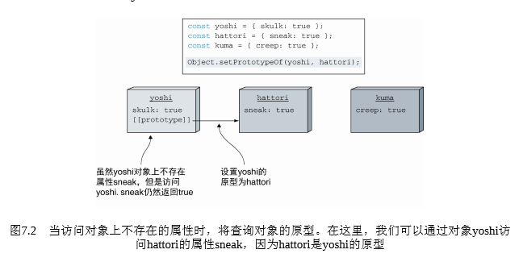
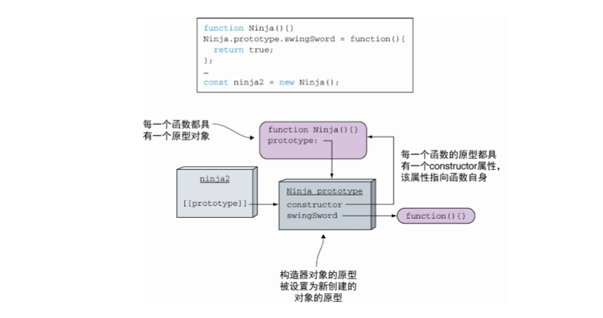
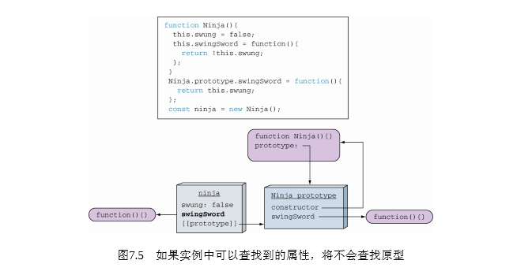
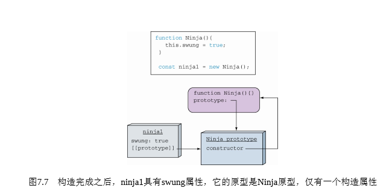
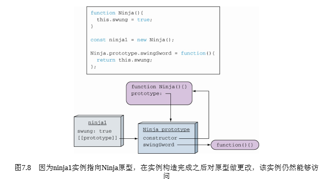
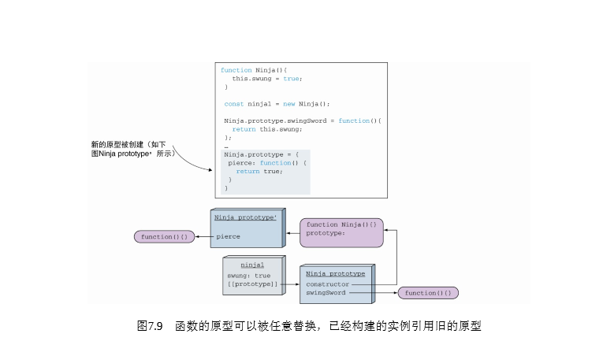
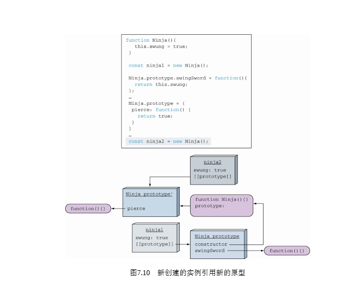

::: tip 概念
JavaScript中原型的主要用途是使用一种类风格的面向对象和继承的方式进行编码<br/>
JavaScript是动态语言，可以修改或删除对象的属性<br/>
继承是代码复用的一种方式，继承有助于合理地组织程序代码，将一个对象的属性扩展到另一个对象上。
在JavaScript中，可通过原型实现继承, 其中其行为被继承的对象称为原型
JavaScript对象可从其他对象那里继承属性和行为。更具体地 说，JavaScript使用原型式继承，其中其行为被继承的对象称为 原型。这旨在继承既有属性（包括方法），同时在新对象中添加属性对象继承另一个对象后，便可访问其 所有方法和属性。
:::

## 原型链
原型链是一种关系，实例对象和原型对象之间的关系，关系是通过原型`(__proto__)`来联系的
JavaScript 对象有一个指向一个原型对象的链。当试图访问一个对象的属性时，它不仅仅在该对象上搜寻，还会搜寻该对象的原型，以及该对象的原型的原型，依次层层向上搜索，直到找到一个名字匹配的属性或到达原型链的末尾。

## 原型

`Object.setPrototypeOf`需要传入两个对象作为参数，并 将第二个对象设置为第一个对象的原型。



需要特别强调的是，每个对象都可以有一个原型`__proto__`，每个对象的原型也可以拥有一个原型，以此类推，形成一个原型链。查找特定属性将会被委托在整个原型链上，只有当没有更多的原型可以进行查找时，才会停止查找

## 对象构造器与原型

每个函数都有一个原型对象`prototype`，该原型对象将被自动设置为通过该函数实例化创建的对象的原型



+ 每一个函数都具有一个原型对象。 
+ 每一个函数的原型对象上都具有一个`constructor`属性，该属性指向函数本身。
+ `constructor`对象的原型设置为新创建的对象的原型`Object.__proto__`或者说对象的原型是构造函数的原型的引用。 
+ `constructor`属性指向构造函数本身。

### 实例属性

`当把函数作为构造函数，通过操作符new进行调用时，它的上下文被定义为新的对象实例`



<p class='tip'>
在构造函数内部定义方法，使得我们可以模仿私有对象变量。如果我们需要私有对象，在构造函数内指定方法是唯一的解决方案。
</p>

### JavaScript动态特性的副作用

`你已经看到JavaScript是一门动态语言，可以很容易地添加、删除和修改属性。这种特性同样适用于原型，包括函数原型和对象原型`





<p align='center'>实例化构造函数之后对原型增加一个方法，该实例仍然可以访问到新增的方法</p>






对象与函数原型之间的引用关系是在对象创建时建立的。新创建的对象将引用新的原型，它只能访问pierce方法，原来旧的对象保持着原有的原型，仍然能够访问swingSword方法


### constructor 检测 对象类型

对象实例是通过构造函数的原型中的`constructor`属性构造的

`constructor`属性仅仅是原始构造函数的引用，因此我们可以使 用该属性创建新的对象,且它创建出来的对象截然不同

``` js
function a(){}

var a1 = new a();

var a2  = new a1.constructor();

var a3 = new a1.constructor();

a2 == a3 // false

a2.constructor === a //　通过constructor引用检测a2的类型，得到的结果为其构造函数的引用

```

::: warning 注意
虽然对象的`constructor`属性有可能发生改变，改变`constructor`属性没有任何直接或明显的 建设性目的（可能要考虑极端情况）。`constructor`属性的存在仅仅是为了说明该对象是从哪 儿创建出来的。如果重写了`constructor`属性，那么原始值就被丢失了。
:::

## 继承

有助于避免重复代码和重复数据

### 原型继承

创建原型链最佳技术方案是一个对象的原型直接是另一个对象的实例


这种原型实现继承的方式的副作用
1、好的一面是，所有继承函数的原型将实时更新。从原型继承的对象总是可以访问当前原型属性。
2、constructor被重写了，我们需要修复它

``` js
Object.defineProperty(Ninja.prototype, "constructor", {
 　	enumerable: false, 　// 不可枚举的
	value: Ninja, 　// 定义一个新的
	writable: true　　// 可通过赋值语句修改属性值
})
```

### ES6 class extends

ES6引入新的关键字class，它提供了一种更为优雅的创建对象和实现继承的方式，底层仍然是基于原型的实现。

[看这里吧](//es6.ruanyifeng.com/#docs/class-extends)
