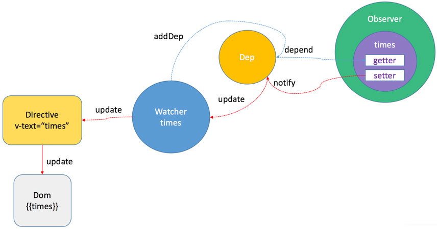
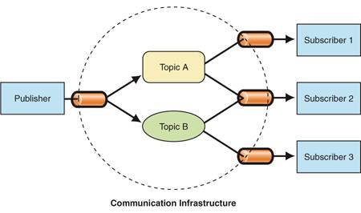

http://zhouweicsu.github.io/blog/2017/03/07/vue-2-0-reactivity/


https://blog.csdn.net/sir1241/article/details/79208038


## 发布者 observer


我们来看一下构造函数

``` js
function Vue(options){
	this._init(options)
}
```


当我们new Vue({})的时候，执行的是_init()方法，这个方法是在initMixin(Vue)这里，
执行_init方法会触发initState(this 当前实例),
在这个inistate方法里面会判断
	1. 如果存在data调用initData(this 当前实例),
	2. 如果不存在data，observe(vm._data = {}, true);
在这个initData中有一个while循环，
	1. 保证data中的key不与props中的key重复，props优先，如果有冲突会产生warning
	2. 检测关键字(methods、proxy、$、_),

`这里有一个知识点就是charCodeAt(i)指定的位置的字符的 Unicode 编码; String.fromCharCode()将 Unicode 编码转为字符。`

这里通过observe实例化Observe对象，开始对数据进行绑定，asRootData用来根数据，用来计算实例化根数据的个数，下面会进行递归observe进行对深层对象的绑定。则asRootData为非true*/
observe(data, true /* asRootData */);
在initData中 执行observe(data, true) 检测data数据,为每个值创建一个观察者实例

我们来看一下 observe 观察者实例 做了些什么

``` js
/*尝试创建一个Observer实例（__ob__），如果成功创建Observer实例则返回新的Observer实例，如果已有Observer实例则返回现有的Observer实例。*/
function observe (value, asRootData) {
	if (!isObject(value) || value instanceof VNode) {
		return // (1)
	}
	var ob;
	/*这里用__ob__这个属性来判断是否已经有Observer实例，如果没有Observer实例则会新建一个Observer实例并赋值给__ob__这个属性，如果已有Observer实例则直接返回该Observer实例，这里可以看Observer实例化的代码def(value, '__ob__', this)*/
	if (hasOwn(value, '__ob__') && value.__ob__ instanceof Observer) {
		ob = value.__ob__; // (2)
	} else if (
	/*这里的判断是为了确保value是单纯的对象，而不是函数或者是Regexp等情况。而且该对象在shouldConvert的时候才会进行Observer。这是一个标识位，避免重复对value进行Observer
		shouldObserve &&
		!isServerRendering() &&
		(Array.isArray(value) || isPlainObject(value)) &&
		Object.isExtensible(value) &&
		!value._isVue
	) {
		ob = new Observer(value); // (3)
	}
	if (asRootData && ob) {
	/*如果是根数据则计数，后面Observer中的observe的asRootData非true*/
		ob.vmCount++;
	}
	return ob
}
```

(1) 如果 data 不是对象就返回，只有对象才继续执行后续步骤
(2) 如果 data 有对应的 Observer 实例 data.__ob__ 那就将它作为 observe 方法返回值
(3) 如果 data 没有对应的 Observer 实例，那就执行 ob = new Observer(value)

我们来看附在每个属性值上面的观察者类 new Observer(value)

``` js
var Observer = function Observer (value) {
	this.value = value;
	this.dep = new Dep();
	this.vmCount = 0;
	def(value, '__ob__', this);
	if (Array.isArray(value)) {
		var augment = hasProto
		? protoAugment
		: copyAugment;
		augment(value, arrayMethods, arrayKeys);
		this.observeArray(value);
	} else {
		this.walk(value); // (4)
	}
};
// 只有属性值是对象的时候才会调用此方法，并将每属性转为setter、getter
Observer.prototype.walk = function walk (obj) {
  var keys = Object.keys(obj);
  for (var i = 0; i < keys.length; i++) {
    defineReactive(obj, keys[i]); // (5)
  }
};
Observer.prototype.observeArray = function observeArray (items) {
  for (var i = 0, l = items.length; i < l; i++) {
    observe(items[i]);
  }
};
// 在一个对象上面 劫持 该对象属性的 get set  操作
function defineReactive (obj,key,val,customSetter,shallow) {
	// 新建主题对象	
	var dep = new Dep();
	/*
	  对象的每一个属性都有相应的描述对象，例如：
	  var o = {a:1}
	  var props = Object.getOwnPropertyDescriptor(o,'a')
	  -> { 
		  value: 1, 值
		  writable: true, 是否可写
		  enumerable: true,  属性是否可枚举
		  configurable: true 描述符是否可更改
		}
	*/
	var property = Object.getOwnPropertyDescriptor(obj, key);
	// 如果 obj 的 key 属性不可配置，直接返回
	if (property && property.configurable === false) {
		return
	}

	// cater for pre-defined getter/setters
	// 该属性之前定义的 getter/setters
	var getter = property && property.get;
	var setter = property && property.set;
	if ((!getter || setter) && arguments.length === 2) {
		val = obj[key];
	}
	/*
		shallow 意思是“浅的”，也就是说若没有指定“浅观察”，那就是“深观察”
		举例来说：
		obj = {
			a : {
				aa : 1
			},
			b : {
				bb : 2
			}
		}
		这里的 val 就不同普通的原始类型值了，val 是 {aa : 1}，{bb : 1} 
		这样的对象，那么就递归遍历 val 对象的属性，劫持其属性的 get/set
	*/
	// 【重要】这句作用就是：递归遍历劫持 val 的所有子属性
	var childOb = !shallow && observe(val);
	/*
		Object.defineProperty(obj, prop, descriptor) 
		参数：
		obj 需要定义属性的对象。
		prop 需被定义或修改的属性名。
		descriptor 需被定义或修改的属性的描述符
		作用：给对象上定义一个新属性，或者修改一个已经存在的属性
	*/
	Object.defineProperty(obj, key, { // (6)
		// 属性可枚举
		enumerable: true,
		 // 描述符可配置
		configurable: true,
		// 获取 obj 的 key 属性时触发该方法
		get: function reactiveGetter () {
			var value = getter ? getter.call(obj) : val;
			if (Dep.target) {
				// 相当于 Dep.target.addDep(dep) 进行依赖收集
				dep.depend(); // (7)
				if (childOb) {
					// 相当于 Dep.target.addDep(childOb.dep)
					// 子对象进行依赖收集，其实就是将同一个watcher观察者实例放进了两个depend中，一个是正在本身闭包中的depend，另一个是子元素的depend
					childOb.dep.depend();
					if (Array.isArray(value)) {
					    // 对数组每项 e 调用 Dep.target.addDep(e.__ob__.dep)
						// 是数组则需要对每一个成员都进行依赖收集，如果数组的成员还是数组，则递归。
						dependArray(value);
					}
				}
			}
			return value
		},
		// 设置 obj 的 key 属性时触发该函数
		set: function reactiveSetter (newVal) {
			 // 获取旧值
			var value = getter ? getter.call(obj) : val;
			/* eslint-disable no-self-compare */
			// 如果旧值和新值相等或者旧值和新值都是 NaN，则不进行设置操作。
			//（NaN 比较特殊，是 js 中唯一不等于自身的值）
			if (newVal === value || (newVal !== newVal && value !== value)) {
				return
			}
			/* eslint-enable no-self-compare */
			// 执行自定义 setter
			if ("development" !== 'production' && customSetter) {
				customSetter();
			}
			// 设置新值
			if (setter) {
				/*如果原本对象拥有setter方法则执行setter*/
				setter.call(obj, newVal);
			} else {
				// 注意：set/set 函数在这里是闭包，所以能共用 val 的值
				val = newVal;
			}
			// 递归遍历 newVal 的所有子属性 /*新的值需要重新进行observe，保证数据响应式*/
			childOb = !shallow && observe(newVal);
			// 通知订阅者，分别执行其 update 方法
			dep.notify(); // (8)
		}
	});
}
```

(4) new Observer(value) 的本质是执行 ob.walk(data)
(5) 依次遍历 data 的属性 key，执行 defineReactive(obj, keys[i], obj[keys[i]])
(6) defineReactive 会劫持属性 key 的 get/set 操作,这样我们就可以实现数据监控到。
(7) 当获取属性 key 时除了返回属性值，还会将 Dep.target（即与属性 key 对应的 watcher）加入到 key 的订阅者数组里（dep.depend() -> Dep.target.addDep(dep)）
(8) 当设置属性 key 时，主题对象 dep 会对所有的订阅者发出通知 dep.notify()

总流程 observe(data, true) --> new Observer(value) ---> defineReactive(obj, )

##### get方法

先为每个data声明一个 Dep 实例对象，被用于getter时执行dep.depend()进行收集相关的依赖;

那么问题来了，我们为啥要收集相关依赖呢？

``` js
new Vue({
    template: 
        `<div>
            <span>text1:</span> {{text1}}
            <span>text2:</span> {{text2}}
        <div>`,
    data: {
        text1: 'text1',
        text2: 'text2',
        text3: 'text3'
    }
});
```

我们可以从以上代码看出，data中text3并没有被模板实际用到，为了提高代码执行效率，我们没有必要对其进行响应式处理，
因此，依赖收集简单点理解就是收集只在实际页面中用到的data数据，然后打上标记，这里就是标记为Dep.target。

##### set 方法

获取新的值并且进行observe，保证数据响应式；
通过dep对象通知所有观察者去更新数据，从而达到响应式效果。

在Observer类中，我们可以看到在getter时，dep会收集相关依赖，即收集依赖的watcher，
然后在setter操作时候通过dep去通知watcher,此时watcher就执行变化.

::: tip 其实我们可以简单理解：
Dep可以看做是书店，Watcher就是书店订阅者，而Observer就是书店的书，订阅者在书店订阅书籍，
就可以添加订阅者信息，一旦有新书就会通过书店给订阅者发送消息。
:::


## 主题方法 dep （中介\依赖）

这是用来管理订阅者的
被Observer的data在触发 getter 时，Dep 就会收集依赖的 Watcher ，其实 Dep 就像刚才说的是一个书店，可以接受多个订阅者的订阅，当有新书时即在data变动时，就会通过 Dep 给 Watcher 发通知进行更新。

``` js
var uid = 0;

/**
 * A dep is an observable that can have multiple
 * directives subscribing to it.
 */
// 主题工厂方法，Dep 是 dependency 的简写，也可以叫依赖
var Dep = function Dep () {
  // 唯一标识符
  this.id = uid++;
  // 订阅者将被添加到这个数组里
  this.subs = [];
};
// 添加订阅者（watcher）[观察者对象]
Dep.prototype.addSub = function addSub (sub) {
  this.subs.push(sub);
};
// 删除订阅者[观察者对象]
Dep.prototype.removeSub = function removeSub (sub) {
  // 先找到 sub 在 this.subs 中的索引，然后删除它
  remove(this.subs, sub);
};
// 添加依赖 /*依赖收集，当存在Dep.target的时候添加观察者对象*/
Dep.prototype.depend = function depend () {
  if (Dep.target) {
    // 相当于 this.addSub(Dep.target)
    // 其中 Dep.target 为订阅者（watcher）
    Dep.target.addDep(this);
  }
};
// 触发更新
Dep.prototype.notify = function notify () {
  // stabilize the subscriber list first
   // 先复制一份订阅者数组，以免执行下面 for 循环过程中该数组改变了
  var subs = this.subs.slice();
  for (var i = 0, l = subs.length; i < l; i++) {
    subs[i].update();
  }
};

// the current target watcher being evaluated.
// this is globally unique because there could be only one
// watcher being evaluated at any time.
// 任何时候只有一个全局唯一的正在进行计算的订阅者
Dep.target = null;
var targetStack = [];
// 旧的 Dep.target 压栈，_target 作为新的 Dep.target
function pushTarget (_target) {
  if (Dep.target) { targetStack.push(Dep.target); }
  Dep.target = _target;
}
// Dep.target 出栈，即恢复旧的 Dep.target
function popTarget () {
  Dep.target = targetStack.pop();
}

```

## 订阅者 watcher

每一个 Watcher 实例就是一个订阅者

Watcher是一个观察者对象。
依赖收集以后Watcher对象会被保存在Dep的subs中，
数据变动的时候Dep会通知Watcher实例，
然后由Watcher实例回调cb进行视图的更新。

``` js
/*  */

var uid$1 = 0;

/**
 * A watcher parses an expression, collects dependencies,
 * and fires callback when the expression value changes.
 * This is used for both the $watch() api and directives.
 */
var Watcher = function Watcher (
  vm,
  expOrFn,
  cb,
  options,
  isRenderWatcher
) {
  this.vm = vm;
  if (isRenderWatcher) {
    vm._watcher = this;
  }
  vm._watchers.push(this);
  // options
  if (options) {
    this.deep = !!options.deep;
    this.user = !!options.user;
    this.computed = !!options.computed;
    this.sync = !!options.sync;
    this.before = options.before;
  } else {
    this.deep = this.user = this.computed = this.sync = false;
  }
  this.cb = cb;
  this.id = ++uid$1; // uid for batching
  this.active = true;
  this.dirty = this.computed; // for computed watchers
  this.deps = [];
  this.newDeps = [];
  this.depIds = new _Set();
  this.newDepIds = new _Set();
  this.expression = expOrFn.toString();
  // parse expression for getter
  if (typeof expOrFn === 'function') {
    this.getter = expOrFn;
  } else {
    this.getter = parsePath(expOrFn);
    if (!this.getter) {
      this.getter = function () {};
      "development" !== 'production' && warn(
        "Failed watching path: \"" + expOrFn + "\" " +
        'Watcher only accepts simple dot-delimited paths. ' +
        'For full control, use a function instead.',
        vm
      );
    }
  }
  if (this.computed) {
    this.value = undefined;
    this.dep = new Dep();
  } else {
    this.value = this.get();
  }
};

/**
 * Evaluate the getter, and re-collect dependencies.
 */
 // 获得getter的值并且重新进行依赖收集
Watcher.prototype.get = function get () {
// 将自身watcher观察者实例设置给Dep.target，用以依赖收集。
  pushTarget(this);
  var value;
  var vm = this.vm;
      /*执行了getter操作，看似执行了渲染操作，其实是执行了依赖收集。
      在将Dep.target设置为自生观察者实例以后，执行getter操作。
      譬如说现在的的data中可能有a、b、c三个数据，getter渲染需要依赖a跟c，
      那么在执行getter的时候就会触发a跟c两个数据的getter函数，
      在getter函数中即可判断Dep.target是否存在然后完成依赖收集，
      将该观察者对象放入闭包中的Dep的subs中去。*/
  try {
    value = this.getter.call(vm, vm);
  } catch (e) {
    if (this.user) {
      handleError(e, vm, ("getter for watcher \"" + (this.expression) + "\""));
    } else {
      throw e
    }
  } finally {
    // "touch" every property so they are all tracked as
    // dependencies for deep watching
	/*如果存在deep，则触发每个深层对象的依赖，追踪其变化*/
    if (this.deep) {
	/*递归每一个对象或者数组，触发它们的getter，使得对象或数组的每一个成员都被依赖收集，形成一个“深（deep）”依赖关系*/
      traverse(value);
    }
	/*将观察者实例从target栈中取出并设置给Dep.target*/
    popTarget();
    this.cleanupDeps();
  }
  return value
};

/**
 * Add a dependency to this directive.
 */
  /*添加一个依赖关系到Deps集合中*/
Watcher.prototype.addDep = function addDep (dep) {
  var id = dep.id;
  if (!this.newDepIds.has(id)) {
    this.newDepIds.add(id);
    this.newDeps.push(dep);
    if (!this.depIds.has(id)) {
      dep.addSub(this);
    }
  }
};

/**
 * Clean up for dependency collection.
 */
  /*清理依赖收集*/
Watcher.prototype.cleanupDeps = function cleanupDeps () {
    var this$1 = this;

  var i = this.deps.length;
  while (i--) {
    var dep = this$1.deps[i];
    if (!this$1.newDepIds.has(dep.id)) {
      dep.removeSub(this$1);
    }
  }
  var tmp = this.depIds;
  this.depIds = this.newDepIds;
  this.newDepIds = tmp;
  this.newDepIds.clear();
  tmp = this.deps;
  this.deps = this.newDeps;
  this.newDeps = tmp;
  this.newDeps.length = 0;
};

/**
 * Subscriber interface.
 * Will be called when a dependency changes.
 */
 /*
      调度者接口，当依赖发生改变的时候进行回调。
   */
Watcher.prototype.update = function update () {
    var this$1 = this;

  /* istanbul ignore else */
  if (this.computed) {
    // A computed property watcher has two modes: lazy and activated.
    // It initializes as lazy by default, and only becomes activated when
    // it is depended on by at least one subscriber, which is typically
    // another computed property or a component's render function.
    if (this.dep.subs.length === 0) {
      // In lazy mode, we don't want to perform computations until necessary,
      // so we simply mark the watcher as dirty. The actual computation is
      // performed just-in-time in this.evaluate() when the computed property
      // is accessed.
      this.dirty = true;
    } else {
      // In activated mode, we want to proactively perform the computation
      // but only notify our subscribers when the value has indeed changed.
      this.getAndInvoke(function () {
        this$1.dep.notify();
      });
    }
  } else if (this.sync) {
  /*同步则执行run直接渲染视图*/
    this.run();
  } else {
  /*异步推送到观察者队列中，下一个tick时调用。*/
    queueWatcher(this);
  }
};

/**
 * Scheduler job interface.
 * Will be called by the scheduler.
 */
 /*
      调度者工作接口，将被调度者回调。
    */
Watcher.prototype.run = function run () {
  if (this.active) {
    this.getAndInvoke(this.cb);
  }
};

Watcher.prototype.getAndInvoke = function getAndInvoke (cb) {
 /* get操作在获取value本身也会执行getter从而调用update更新视图 */
  var value = this.get();
  if (
    value !== this.value ||
    // Deep watchers and watchers on Object/Arrays should fire even
    // when the value is the same, because the value may
    // have mutated.
	/*
            即便值相同，拥有Deep属性的观察者以及在对象／数组上的观察者应该被触发更新，因为它们的值可能发生改变。
        */
    isObject(value) ||
    this.deep
  ) {
    // set new value
    var oldValue = this.value;
	 /*设置新的值*/
    this.value = value;
    this.dirty = false;
	 /*触发回调*/
    if (this.user) {
      try {
        cb.call(this.vm, value, oldValue);
      } catch (e) {
        handleError(e, this.vm, ("callback for watcher \"" + (this.expression) + "\""));
      }
    } else {
      cb.call(this.vm, value, oldValue);
    }
  }
};

/**
 * Evaluate and return the value of the watcher.
 * This only gets called for computed property watchers.
 */
 /*获取观察者的值*/
Watcher.prototype.evaluate = function evaluate () {
  if (this.dirty) {
    this.value = this.get();
    this.dirty = false;
  }
  return this.value
};

/**
 * Depend on this watcher. Only for computed property watchers.
 */
  /*收集该watcher的所有deps依赖*/
Watcher.prototype.depend = function depend () {
  if (this.dep && Dep.target) {
    this.dep.depend();
  }
};

/**
 * Remove self from all dependencies' subscriber list.
 */
 /*将自身从所有依赖收集订阅列表删除*/
Watcher.prototype.teardown = function teardown () {
    var this$1 = this;

  if (this.active) {
    // remove self from vm's watcher list
    // this is a somewhat expensive operation so we skip it
    // if the vm is being destroyed.
    if (!this.vm._isBeingDestroyed) {
      remove(this.vm._watchers, this);
    }
    var i = this.deps.length;
    while (i--) {
      this$1.deps[i].removeSub(this$1);
    }
    this.active = false;
  }
};
```

## 总结

其实在 Vue 中初始化渲染时，视图上绑定的数据就会实例化一个 Watcher，
依赖收集就是是通过属性的 getter 函数完成的，
文章一开始讲到的 Observer 、Watcher 、Dep 都与依赖收集相关。
其中 Observer 与 Dep 是一对一的关系， Dep 与 Watcher 是多对多的关系，Dep 则是 Observer 和 Watcher 之间的纽带。
依赖收集完成后，当属性变化会执行被 Observer 对象的 dep.notify() 方法，
这个方法会遍历订阅者（Watcher）列表向其发送消息， Watcher 会执行 run 方法去更新视图，我们再来看一张图总结一下：



在 Vue 中模板编译过程中的指令或者数据绑定都会实例化一个 Watcher 实例，实例化过程中会触发 get() 将自身指向 Dep.target;

data在 Observer 时执行 getter 会触发 dep.depend() 进行依赖收集;
依赖收集的结果：1、data在 Observer 时闭包的dep实例的subs添加观察它的 Watcher 实例；2. Watcher 的deps中添加观察对象 Observer 时的闭包dep；

当data中被 Observer 的某个对象值变化后，触发subs中观察它的watcher执行 update() 方法，最后实际上是调用watcher的回调函数cb，进而更新视图。

## 简单了解一下设计模式

### 观察者模式

观察者模式在软件设计中是一个对象，维护一个依赖列表，当任何状态发生改变自动通知它们。

我们假设你正在找一份软件工程师的工作，对“香蕉公司”很感兴趣。所以你联系了他们的HR，给了他你的联系电话。
他保证如果有任何职位空缺都会通知你。这里还有几个候选人也你一样很感兴趣,
所以职位空缺大家都会知道。如果你回应了公司的通知，公司就会联系你面试.

::: tip 所以，以上和“观察者模式”有什么关系呢？
这里的“香蕉公司”就是Subject[发布者]，用来维护Observers（和你一样的候选人）[观察者]，为某些event（比如职位空缺）[动作]来通知（notify）观察者(observer)
:::

如下图：


### 发布-订阅模式

跟观察者很类似 发布者(publishers) -> 订阅者(Subscriber)



在发布-订阅模式，消息的发送方，叫做发布者（publishers），消息不会直接发送给特定的接收者（订阅者）。他们中间有一个媒介(就当它是中介吧);
意思就是发布者和订阅者不知道对方的存在。需要一个第三方组件，叫做信息中介，它将订阅者和发布者串联起来，它过滤和分配所有输入的消息。
换句话说，发布-订阅模式用来处理不同系统组件的信息交流，即使这些组件不知道对方的存在。

> 发布—订阅模式可以广泛应用于异步编程中，这是一种替代传递回调函数的方案。 比如，我们可以订阅ajax请求的`error`、`success`等事件。或者如果想在动画的每一帧完成之后做一些事情，那我们可以订阅一个事件，然后在动画的每一帧完成之后发布这个事件。在异步编程中使用发布—订阅模式，我们就无需过多关注对象在异步运行期间的内部状态，而只需要订阅感兴趣的事件发生点。

> 发布—订阅模式可以取代对象之间硬编码的通知机制，一个对象不用再显式地调用另外一个对象的某个接口。发布—订阅模式让两个对象松耦合地联系在一起，虽然不太清楚彼此的细节，但这不影响它们之间相互通信。当有新的订阅者出现时，发布者的代码不需要任何修改;同样发布者需要改变时，也不会影响到之前的订阅者。只要之前约定的事件名没有变化，就 可以自由地改变它们。


### 区别


1\ 在观察者模式中，观察者是知道Subject的，Subject一直保持对观察者进行记录。然而，在发布订阅模式中，发布者和订阅者不知道对方的存在。它们只有通过消息代理进行通信。
2\ 在发布订阅模式中，组件是松散耦合的，正好和观察者模式相反。
3\ 观察者模式大多数时候是同步的，比如当事件触发，Subject就会去调用观察者的方法。而发布-订阅模式大多数时候是异步的（使用消息队列）。
4\ 观察者模式需要在单个应用程序地址空间中实现，而发布-订阅更像交叉应用模式。
