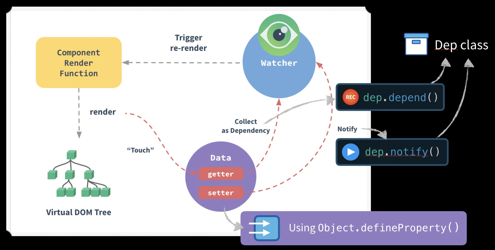

## new操作符

``` js
function Test(name) {
  this.name = name
}
Test.prototype.sayName = function () {
    console.log(this.name)
}
const t = new Test('yck')

// 以下是conosle.log(t)输出
Test {
    name: "yck"
    __proto__:{
        sayName: ƒ ()
        constructor: ƒ Test(name)
            arguments: null
            caller: null
            length: 1
            name: "Test"
            prototype: {sayName: ƒ, constructor: ƒ}
            __proto__: ƒ ()
            [[FunctionLocation]]: VM4610:1
            [[Scopes]]: Scopes[2]
        __proto__: Object
    }
}
```

我们来跟踪一下其执行过程。

+ new 首先创建一个新的空对象
+ 接下来，new设置this，使其指向这个新对象
	- 这个this存储了一个引用，指向代码当前处理的对象
+ 设置this后，调用函数Test，并将yck当作实参传递给它
+ 接下来，执行这个函数代码，与大多数构造函数一样，Test给新创建的this对象的属性赋值
+ 最后，Test函数执行完毕后，运算符new返回this--指向新创建的对象的引用。请注意，它会自动为你返回this，你无需在代码中显式地返回。指向新对象的引用被返回后，我们将其赋给变量t

从上面我们可以知道

+ new 操作符会返回一个新对象，所以我们需要在内部创建一个对象
+ 这个对象可以访问构造函数上的任意属性,可以访问到构造函数原型上的属性，所以需要将对象与构造函数链接起来
+ 返回原始值需要忽略，返回对象需要正常处理

回顾了这些作用，我们就可以着手来实现功能了

`Object.create(prototype/null)`返回值是一个新对象，带着指定的原型对象和属性。

`Object.setPrototypeOf({},prototype/null)`设置一个指定的对象的原型 ( 即, 内部[[Prototype]]属性）到另一个对象或null。

```js
function create(Con, ...args) {
//   let obj = {};
//   Object.setPrototypeOf(obj, Con.prototype)
    let obj = Object.create(Con.prototype)
    let result = Con.apply(obj, args)
    return result instanceof Object ? result : obj
}
```

关于构造函数返回值的问题：

+ 构造函数会默认返回this，也就是新的实例对象
+ 普通函数如果没有return值的话，返回undefined
+ return的是五种简单数据类型：String,Number,Boolean,Null,Undefined的话，构造函数会忽略return的值，依然返回this对象
+ 如果return的是引用类型：Array,Date,Object,Function,RegExp,Error的话，构造函数和普通函数都会返回return后面的值,构造函数的原型不被使用

## js数据类型

栈(stack)会自动分配内存空间，会自动释放。<br>
堆(heap)动态分配的内存，大小不定也不会自动释放

基本数据类型：值存放在栈内存中，占据固定大小的空间，访问方式是按值访问。`Undefined,String,Boolean,Null,Number,Symbol`

引用类型：值保存在堆内存中,包含引用类型的变量实际上保存的不是变量本身，而是指向该对象的指针，访问方式是按引用访问。`Object，Array，Function`

js弱类型语言，变量的类型由其值所决定, 赋值过程中发生了强制类型转换

#### 类型转换的原理

+ ToPrimitive
+ ToString
+ ToNumber
+ ToBoolean
+ toObject

### js转换规则不同场景应用

+ 什么时候自动转换为string类型
	- (在没有对象情况下)字符串的自动转换，主要发生在字符串的`加法运算`时。当一个值为字符串，另一个值为非字符串，则后者转为字符串。
	``` js
	'2' + 1 // '21'
	'2' + true // "2true"
	'2' + false // "2false"
	'2' + undefined // "2undefined"
	'2' + null // "2null"
	```
	- 当有对象且与对象+时候
	``` js
	//toString的对象
	var obj2 = {
		toString:function(){
			return 'a'
		}
	}
	console.log('2'+obj2)
	//输出结果2a

	//常规对象
	var obj1 = {
	a:1,
	b:2
	}
	console.log('2'+obj1)；
	//输出结果 2[object Object]

	//几种特殊对象
	'2' + {} // "2[object Object]"
	'2' + [] // "2"
	'2' + function (){} // "2function (){}"
	'2' + ['koala',1] // 2koala,1
	```

+ 什么时候自动转换为Number类型
	- 加减乘除运算符
	``` js
	true + 0 // 1
	true + true // 2
	true + false //1
	'5' - '2' // 3
	'5' * '2' // 10
	true - 1  // 0
	false - 1 // -1
	'1' - 1   // 0
	'5' * []    // 0
	false / '5' // 0
	'abc' - 1   // NaN
	null + 1 // 1
	undefined + 1 // NaN

	//一元运算符（注意点）
	+'abc' // NaN
	-'abc' // NaN
	+true // 1
	-false // 0	
	```
	::: tip 注意：
	null转为数值时为0，而undefined转为数值时为NaN。
	:::

+ 什么时候进行布尔转换
	- if、while判断
	- 三元运算符、逻辑运算符
	``` js
	if ( !undefined
		&& !null
		&& !0
		&& !NaN
		&& !''
	) {
		console.log('true');
	} // true

	//下面两种情况也会转成布尔类型
	expression ? true : false
	!! expression
	```

## == 与 === 你真的明白吗

### 抽象运算：

这些操作不是ECMAScript语言的一部分；它们在这里的定义只是为了帮助规范ECMAScript语言的语义。

ECMAScript语言根据需要隐式执行自动类型转换。

+ ToPrimitive(input, [PreferredType]) 将输入的参数转化为非对象类型
	- input 输入参数
	- preferredType 可选参数，需要转化成什么类型
	- 如果是基本类型`Undefined Null Boolean Number String Symbol` 返回他们本身
	- 如果是`Object`
		+ preferredType = string
			- 先调用toString(), 如果返回原始值则return；否则调用valueOf()
		+ preferredType = number
			- 先调用valueOf(), 如果返回原始值则return；否则调用toString()
		+ preferredType = ''
			- 如果对象是Date，则 preferredType被设置为string
			- 否则preferredType 被设置为number
	- Object.prototype.toString() 对象的字符串
	- Object.prototype.valueOf() 对象的原始值
	
+ ToBoolean(argument) 将参数转为boolean类型
	- 如果是`Undefined Null` 则返回“false”
	- 如果是`Object Symbol` 则返回“true”
	- 如果是`Number` 
		+ 如果是`+0 -0 NaN` 则返回 “false”
		+ 否则返回“true”
	- 如果是`String` 
		+ 如果是空字符串 则返回“false”
		+ 否则返回“true”

+ ToNumber(argument) 将参数转为number类型
	- 如果是`Undefined` 则返回 “NaN”
	- 如果是 `Null` 则返回 “+0”
	- 如果是 `Boolean` 
		+ 如果入参论据“true” 返回 “+1”
		+ 如果入参论据“false” 返回 “+0”
	- 如果是 `String` 则 涉及到编码自己看吧
		+ 如果无法将字符串解释为`StringNumericLiteral`的扩展，则ToNumber(string) 返回NaN
		+ 如果是空、空格(whatespace)返回‘0’
		+ [规则](//www.ecma-international.org/ecma-262/6.0/index.html#sec-tonumber)
	- 如果是`Symbol` 则 抛出“typeError”
	- 如果是`Object` 则 “ToNumber(ToPrimitive(argument, hint Number))”

+ ToString(argument) 将参数转换为string类型
	- 如果是 `undefined` 返回 ‘undefined’
	- 如果是 `Null` 返回 ‘null’
	- 如果是 `Boolean` 
		+ 如果是 ·true· 返回 ‘true’
		+ 如果是  `false` 返回 ‘false’
	- 如果是`Number` 则
		+ 如果argument是NaN,则返回字符串NaN
		+ 如果argument是+0、-0，则返回字符串0
		+ 如果argument小于0，则返回字符串argument
		+ 如果argument是正无穷大， 则返回字符串 "Infinity"
		+ 剩下的就是进制的区别，自己去看吧
	- 如果是 `string` 返回 本身
	- 如果是`Symbol` 返回 ‘TypeError’
	- 如果是`Object` 返回 ‘ToString(ToPrimivite(argument, hint String))’

+ toObject(argument) 将参数转换为object类型
	- 如果是 `undefined` 返回 抛出‘TypeError’
	- 如果是 `Null` 返回 抛出‘TypeError’
	- 如果是 `Boolean` 返回一个boolean对象
	- 如果是`Number` 返回一个Number对象
	- 如果是 `string` 返回一个string对象
	- 如果是`Symbol` 返回一个ymbol对象
	- 如果是`Object` 返回 本身

接下来正题：

### 抽象相等比较

+ 如果类型x与类型y相同，如果值相同则true，值不同返回false
+ 如果x为空，y未定义，则返回true
+ 如果x未定义，y为空，则返回true
+ 如果x的类型是number，y的类型是字符串，则比较结果x == ToNumber(y)
+ 如果x的类型是string，y的类型是number，则比较结果ToNumber(x) == y
+ 如果x的类型是boolean，则比较结果ToNumber(x) == y
+ 如果y的类型是boolean，则比较结果 x == ToNumber(y)
+ 如果x的类型是string、number、symbol，y的类型是object，则比较结果是 x == ToPrimitive(y, [string\number\symbol\])
+ 如果x的类型是object，y的类型是string、number、symbol ，则比较ToPrimitive(x) == y


### 严格相等比较

+ 如果x的类型与y的类型不同，返回false
+ 如果x,y的类型是Undefined,返回true
+ 如果x,y的类型是Null,返回true
+ 如果x,y的类型是number
	- 如果是 x是NaN，返回false
	- 如果是 y是NaN，返回false
	- 如果x，y返回的值相同，返回true
	- 如果x是+0，y是-0，返回true
	- 如果x是-0，y是+0，返回true
+ 如果x，y是string
	- 如果是相同的编码，相同的长度，返回true
	- 否则返回false
+ 如果x，y是boolean
	- 如果x，y都是true或者false，返回true
	- 否则返回false
+ 如果x，y是相同的symbol值，返回true
+ 如果x,y是相同的object值，返回true


### 案例

`'' == NaN `
根据规范 左边是string，右边是number，则 ToNumber('') == 0 ,false

`'' == 0`
根据规范 左边是string，右边是number，则 ToNumber('') == 0 ,true

[ecma-262/6.0](//www.ecma-international.org/ecma-262/6.0/index.html#sec-type-conversion)

`valueOf()` 他是返回一个指定类型[Number、Object、Boolean、Date]的原始值

|类型|返回值|
|----|:-----|
|Array|返回数组本身|
|Boolean|布尔值|
|Date|当前毫秒数|
|Function|函数本身|
|Number|数字值|
|Object|对象本身|
|String|字符串值|
||Math、Error对象没有valueOf方法|

+ [stackoverflow.com](https://stackoverflow.com/questions/359494/which-equals-operator-vs-should-be-used-in-javascript-comparisons/359509#359509)


## 在 Vue 中，子组件为何不可以修改父组件传递的 Prop，如果修改了，Vue 是如何监控到属性的修改并给出警告的。

::: tip 
首先父级的组件发生更新，子组件的`prop`也会更新为最新值，数据流就单向的；
如果是基本类型值改变，则会控制台发生警告
如果是对象和数组值改变，会更新，不发生警告[如果是更新当前对象的值会 发生警告]

可使用两种方案解决：

1、在子组件中定义一个本地的 `data` 属性并将这个 `prop` 用作其初始值

2、在子组件中使用这个 `prop` 的值来定义一个计算属性`computed`
:::

第二个问题：如果修改了，Vue 是如何监控到属性的修改并给出警告的

+ 模板解析
	- initProps 
		- vm.$options.propsData 获取父组件传递给子组件的 `prop` 数据
		- 通过for in  遍历可枚举属性，所以不会深度遍历，调用 loop(key)
			+ !isRoot !isUpdatingChildComponent 都是true
			+ 通过 `defineReactive$$1` 
				- 这里注入了 customSetter  defineReactive$$1错误提示信息 ·Avoid mutating a prop directly·
				- 为每个属性添加依赖 dep
			+ `updateListeners` 注册绑定监听事件
				- `createFnInvoker`
				- `add`
	- ...其他生命周期解析

+ 触发更新的时候
	- 执行 `invoker`
	- 判断绑定事件是否是数组
	- 不是数组将会return 出错误
	- `invokeWithErrorHandling`
	- 通过 apply 执行事件
	- Object.defineProperty 修改定义属性的值
	- customSetter  !isRoot !isUpdatingChildComponent 都是true
	- 执行 defineReactive$$1 注册是回调函数 warn [引用类型中 newVal===value return 出去了 ]
	- 子组件状态改变 控制台出现警告[引用类型不出警告，父子组件状态都改变]

用下面的例子来说明：

``` js
	Vue.component('Zoo', {
		props: ['ddd', 'aaa'],
		template: '<h3 @click="zzzw">{{ ddd }}</h3>',
		mounted(){
			console.log(this.aaa)
		},
		methods:{
			zzzw(){
				this.ddd = 'mmmmmmmmmm'
			}
		}
	})
	new Vue({
		el:'#app',
		data:{
			ddd:'ssss',
			aaa:{
				www:'2222'
			}
		}
	});

```

## vue双向数据绑定

### A Dependency Class 依赖类

#### 解决的问题

扩展我们的应用程序，维护一个类，当我们需要他们重新运行时，他们会得到通知

#### 用法及含义

+ 标准编程观察者模式的依赖类

``` js
class Dep { // 依赖类
	constructor () {
		this.subscribers = [] // 订阅池，当我们调用 notify() 时来运行
	}
	depend() {  // 收集目标到订阅池
		if (target && !this.subscribers.includes(target)) {
			// 如果目标存在且不在订阅池
			this.subscribers.push(target)
		} 
	}
	notify() {  // 重复更新
		this.subscribers.forEach(sub => sub()) // 运行
	}
}

const dep = new Dep()
    
let price = 5
let quantity = 2
let total = 0
let target = () => { total = price * quantity }
dep.depend() // Add this target to our subscribers
target()  // Run it to get the total

console.log(total) // => 10 .. The right number
price = 20
console.log(total) // => 10 .. No longer the right number
dep.notify()       // Run the subscribers 
console.log(total) // => 40  .. Now the right number
```

### A Watcher Function 观察者功能

#### 解决的问题

``` js
target = () => { total = price * quantity }
dep.depend() 
target() 
```

更好的封装创建需要监视更新的匿名函数的行为，可修改

``` js
watcher(() => {
	total = price * quantity
})
```

#### 用法及含义

``` js
function watcher(myFunc) {
	target = myFunc // Set as the active target
	dep.depend()       // Add the active target as a dependency
	target()           // Call the target
	target = null      // Reset the target
}
```
该watcher函数接受一个myFunc参数，将其设置为我们的全局target属性，调用dep.depend() 将我们的目标添加为订阅者，调用该target 函数，然后重置该函数target。

### Object.defineProperty()

#### 解决的问题

我们有一个`Dep`类，我们希望每个变量都要有自己的`Dep`

#### 用法及含义

+ 该静态方法允许对对象上的属性进行精确的添加或修改。

+ 对象中存在的属性描述符有两种主要形式：`data descriptors` 和 `accessor descriptors`

+ data descriptors
	- value 属性对应的值
	- writable 当且仅当该属性的writable为true时，value才能被赋值运算符改变。默认为 false

+ accessor descriptors
	- set 当属性值修改时，触发执行该方法。该方法将接受唯一参数，即该属性新的参数值。
	- get 当访问该属性时，该方法会被执行，方法执行时没有参数传入，但是会传入this对象

``` js
let data = {price:5,quantity:2}

Object.keys(data).forEach(key =>{
	let internalValue = data[key];
	Object.defineProperty(data, key, {
		get(){
			console.log(`Getting ${key} : ${internalValue}`)
			return internalValue
		},
		set(newVal){
			console.log(`Setting ${key} to : ${newVal}`)
			internalValue = newVal;
		}
	})
})
total = data.price * data.quantity;
data.price = 20;
```

### Putting both ideas together 结合

#### 解决的问题

`total = data.price * data.quantity`

当像这样的一段代码运行并获得值时price，我们想要price记住这个匿名函数（target）。这样，如果price更改，或设置为新值，它将触发此函数以重新运行，因为它知道此行依赖于它

+ 方案1
	- get => (读取属性值的时候) 记住这个匿名函数，当我们的值发生变化时，我们会再次运行它。
	- set => (设置属性值的时候) 运行保存的匿名函数，我们的值刚改变。
+ 方案2
	- 调用dep.depend()以保存当前target
	- 调用dep.notify()，重新运行全部targets

让我们结合这两个想法，并完成我们的最终代码。

``` js
let data = {price: 5, quantity: 2}
let target = null;

// dep 类
class Dep{
	constructor(){
		this.subscribers = []
	}
	depend(){
		if(target && !this.subscribers.includes(target)){
			this.subscribers.push(target)
		}
	}
	notify(){
		this.subscribers.forEach(sub => sub())
	}
}

// 监听数据每个属性
Object.keys(data).forEach(key => {
	let internalValue = data[key];
	// 每个属性都获取依赖项实例
	const dep = new Dep();
	Object.defineProperty(data, key, {
		get(){ // 读取属性值时
			dep.depend(); // 收集依赖（目标）到订阅池
			return internalValue;
		},
		set(newVal){ // 设置属性值
			internalValue = newVal;
			dep.notify(); // 重新运行 存储的函数	
		}
	})
})

// 我的观察者不再调用dep.depend，因为它是从get方法内部调用的。
function watcher(myFunc){
	target = myFunc;
	target();
	target = null;
}

watcher(() => {
	data.total = data.price * data.quantity
})
```


+ 看到一个紫色数据圈`data circle` 带有 `getter setter` 属性
+ 每个组件实例有一个 `watcher` (观察者)实例， 
	- 当读取属性值，它从 `getter`中收集依赖(目标)
	- 当设置属性值，它从 `setter`中通知观察者，从而导致组件重新呈现
+ 如图：



### 总结

+ 创建一个Dep类来收集依赖项(依赖) 并重新运行所有依赖项(botify)
+ 创建一个观察程序来管理我们正在运行的代码，这些代码可能需要作为依赖项添加(目标)
+ 使用Object.defineProperty() 为每个属性创建getter setter，让每个属性都有dep实例

双向数据绑定 [参考](https://www.vuemastery.com/courses/advanced-components/build-a-reactivity-system/)

## vue $attr $listeners 用法

## vue.use()

### 初始化

+ initGlobalAPI(obj)
	- initUse(obj)

``` js
obj.use = function (plugin: Function | Object) {
	const installedPlugins = (this._installedPlugins || (this._installedPlugins = [])) // 已安装的插件
	if (installedPlugins.indexOf(plugin) > -1) {
		return this
	}

	// additional parameters 传递给函数的参数的类数组对象
	const args = toArray(arguments, 1)
	// 将一个或多个元素添加到数组的开头，并返回该数组的新长度
	args.unshift(this)
	// plugin 是对象
	if (typeof plugin.install === 'function') {
		plugin.install.apply(plugin, args)
	// plugin 是函数
	} else if (typeof plugin === 'function') {
		plugin.apply(null, args)
	}
	// 插入到数组池
	installedPlugins.push(plugin)
	return this
}
// apply 改变当前函数的this指针
```

+ this指向 一个是当前组件 一个是null
+ 会自动阻止多次注册相同插件，届时只会注册一次该插件

[具体参考](//css-tricks.com/getting-started-with-vue-plugins/)

## Vue和React组件通信

<p class="tip">
节制地使用 `$parent` 和 `$children` - 它们的主要目的是作为访问组件的应急方法。更推荐用 `props` 和 `events` 实现父子组件通信
</p>

+ vue 父组件 传 子组件
	- 子组件定义`props[可以是数组、对象]`来接收父组件的数据
		+ 如果直接修改数据
			- 基本类型会提示警告，修改失败
			- 引用类型第一级别会提示警告，修改失败；第二级以后父子同时会改变
		+ 如果用一个对象同时设置多个 prop 的时候，父组件可通过`v-bind.sync="doc"`设置，则每一个属性 都作为一个独立的 prop 传进去子组件
	- 父组件可以使用`$children`来访问子组件实例
	- 父组件可以使用`$ref` 来访问子组件的实例或者DOM元素
	- `provide(父组件定义) / inject(子组件获取)`
	- `$attr / $listeners`
		+ $attrs 父组件通信子组件
		+ 子组件通过 $attrs 可以获取没有被子组件作为 props 特性绑定的传递过来的值
		``` js
			//父组件
			<A msg='1111' df='222'>
			//子组件
			{
				props:['msg'],
				mounted(){
					console.log(this.$attrs) // 输出 {df:'222'}
				}
			}
		```
		+ 子组件可以通过 v-bind='$attrs' 显性的绑定 可手动绑定到子组件的其他位置
		+ 父组件通信子组件，如果子组件中没有通过props来接受父组件传递的值，那么将会在子组件根元素通过html属性的方式追加
		``` js
			//父组件
			<AB msg='1111' sd='2222'>
			//子组件
			<div sd='2222'>{{msg}}</div>
			{
				props:['msg']
			}
		```
		+ 我们可以通过 inheritAttrs : false 这些默认行为将会被去掉,但是我们还是可以通过$attr获取
		``` js
			//父组件
			<zi msg='sss' es='eee' />
			//子组件
			<zi v-bind='$attr'>
			//孙组件
			<sun>
			{
				mounted(){
					console.log(this.$attr) // {msg:'sss', es:'eee'}
				}
			}
		```
	- `v-model`


+ vue 子组件 传 父组件
	- 子组件可以使用`$parent`来访问父组件实例
	- 子组件通过`$emit`触发, 触发当前实例上的事件；父组件`$on`监听当前实例上的自定义事件

+ vue  非父子组件
	- 通过一个事件栈
	- vuex、redux、mobox、Flux
	
+ react 
	- 父组件可以向子组件通过传 props 的方式，向子组件进行通讯。
	- 如果父组件与子组件之间不止一个层级，可通过 `... 运算符`
		``` js
		// 通过 ... 运算符 向 Child_1_1 传递 Parent 组件的信息
			class Child_1 extends Component{
			  render() {
				return <div>
				  <p>{this.props.msg}</p>
				  <Child_1_1 {...this.props}/>
				</div>
			  }
			}

			class Child_1_1 extends Component{
			  render() {
				return <p>{this.props.msg}</p>
			  }
			}
		```
	- 子组件向父组件通讯，同样也需要父组件向子组件传递 `props`进行通讯，只是父组件传递的，是作用域为父组件自身的函数，子组件调用该函数，将子组件想要传递的信息，作为参数，传递到父组件的作用域中

+ react 兄弟组件间通讯
	- 他们有一个共同点同一个父级，所以我们就可以子1传父，父传子2，这样就有一个为题，会导致所有组件（父子）render一遍
	- Flux 与 Redux
	- eventProxy
		+ on、one：on 与 one 函数用于订阅者监听相应的事件，并将事件响应时的函数作为参数，on 与 one 的唯一区别就是，使用 one 进行订阅的函数，只会触发一次，而 使用 on 进行订阅的函数，每次事件发生相应时都会被触发。
		+ trigger：trigger 用于发布者发布事件，将除第一参数（事件名）的其他参数，作为新的参数，触发使用 one 与 on 进行订阅的函数。
		+ off：用于解除所有订阅了某个事件的所有函数。
	``` js
	// eventProxy.js
		'use strict';
		const eventProxy = {
		  onObj: {},
		  oneObj: {},
		  on: function(key, fn) {
			if(this.onObj[key] === undefined) {
			  this.onObj[key] = [];
			}

			this.onObj[key].push(fn);
		  },
		  one: function(key, fn) {
			if(this.oneObj[key] === undefined) {
			  this.oneObj[key] = [];
			}

			this.oneObj[key].push(fn);
		  },
		  off: function(key) {
			this.onObj[key] = [];
			this.oneObj[key] = [];
		  },
		  trigger: function() {
			let key, args;
			if(arguments.length == 0) {
			  return false;
			}
			key = arguments[0];
			args = [].concat(Array.prototype.slice.call(arguments, 1));

			if(this.onObj[key] !== undefined
			  && this.onObj[key].length > 0) {
			  for(let i in this.onObj[key]) {
				this.onObj[key][i].apply(null, args);
			  }
			}
			if(this.oneObj[key] !== undefined
			  && this.oneObj[key].length > 0) {
			  for(let i in this.oneObj[key]) {
				this.oneObj[key][i].apply(null, args);
				this.oneObj[key][i] = undefined;
			  }
			  this.oneObj[key] = [];
			}
		  }
		};

		export default eventProxy;
	```

## [1,2,3].map(parseInt)

+ parseInt() 函数可解析一个字符串，并返回一个整数。
	- string 要被解析的字符串。
	- radix 转化的进制数

+ array.map(function(currentValue, index,arr){}, thisValue)
	- currentValue 当前元素的值
	- index 当前元素的索引值
	- arr 当前元素属于的数组对象
	- thisValue 对象作为该执行回调时使用，传递给函数，用作 "this" 的值。如果省略了 thisValue ，"this" 的值为 "undefined"

``` bash
var parseInt = function(string, radix, obj) {
    return string + "-" + radix + "-" + obj;
};

["1", "2", "3"].map(parseInt);
// ["1-0-1,2,3", "2-1-1,2,3", "3-2-1,2,3"]
// "-" + obj 导致obj调用toString()方法自动转换为了string,相当于连接符
// 第1次遍历：1 + "-" + 0 + "-" + [1,2,3]="1-0-1,2,3"

//toString()还有以下几种特殊情况
[{a:1},{b:2}].toString()//"[object Object],[object Object]"
[1,2].toString()//"1,2"
[[1,2],[3,4]].toString()//"1,2,3,4"
```

我们还需要了解进制数的相关知识：

二进制的定义：用0和1两个数码来表示的数。

三进制的定义：用0和1，2三个数码来表示的数......

十进制的定义：用0和1，2，3...9十个数码来表示的数。

``` bash
//以2为基数，
parseInt('1', 2)//1
parseInt('2', 2)//NaN
parseInt('3', 2)//NaN
parseInt('10',2)//2
//以3为基数，
parseInt('1', 3)//1
parseInt('2', 3)//2
parseInt('3', 3)//NaN
parseInt('10',3)//3
//以4为基数，
parseInt('1', 4)//1
parseInt('2', 4)//2
parseInt('3', 4)//3
parseInt('4', 4)//NaN
parseInt('10',4)//4

['1','2','3'].map(parseInt)
//  parseInt('1', 0) -> 1   // radix=0,以10为基数解析 1*10^1+0*10^0=10
//  parseInt('2', 1) -> NaN // radix=1<2,返回NaN
//  parseInt('3', 2) -> NaN // 3无法转成二进制
//即遍历后结果为 [1,NaN,NaN]

[1,2,3,4,3,4,6,8,9, 99, 888].map(parseInt)
// [1, NaN, NaN, NaN, 3, 4, NaN, NaN, NaN, NaN, 888]
```

::: tip 
我们可以这样理解，二进制里没有2，3，...9,三进制里没有3，4...9,四进制里没有4，5...9
即当string无法转成radix基数时会返回NaN
:::


## throttle debounced

::: tip 防抖和节流的作用都是防止函数多次调用。

区别在于，
假设一个用户一直触发这个函数，
且每次触发函数的间隔小于wait，
防抖的情况下不会触发并从新计算wait时间，直到空闲时间大于await，
节流函数上次执行函数时间 空闲大于await就会执行。

:::

### throttle 节流

+ 在特定间隔内调用函数
+ 节流是使重复事件发生率的降低
+ 适用于在调整大小和滚动等事件上限制处理程序执行速率

``` js

function throttle(func, timeout) {
    let ready = true;
    return (...args) => {
        if (!ready) {
            return;
        }

        ready = false;
        func(...args);
        setTimeout(() => {
            ready = true;
        }, timeout);
    };
}

```

### debounced 去抖

+ 在一定时间内仅调用一次函数
+ 去抖可确保为可能发生多次的事件恰好发生一次

``` js

function debounce(func, timeout) {
    let timer;
    return (...args) => {
        clearTimeout(timer);
        timer = setTimeout(() => {
            func(...args);
        }, timeout);
    };
}

```

## js 克隆、拷贝

`Object.assign({},)` 无法实现多层深拷贝

只针对  object number string boolean date function

```js

_clone(value, [], [], true)

function _cloneRegExp(pattern){
    return new RegExp(pattern.source, 
        (pattern.global ? 'g' : '') + 
        (pattern.ignoreCase ? 'i' : '') +
        (pattern.multiline ? 'm' : '') +
		(pattern.sticky ? 'y' : '') +
		(pattern.unicode ? 'u' : '')
    );
}
/**
  *复制一个对象。
  *
  * @私人的
  * @param {*} value要复制的值
  * @param {Array} refFrom包含源引用的数组
  * @param {Array} refTo包含复制的源引用的数组
  * @param {Boolean} deep是否执行深度克隆。
  * @return {*}复制的值。
*/
function _clone(value, refFrom, refTo, deep){
	var copy = function copy(copiedValue){
		var len = refFrom.length;
		var idx = 0;
		while(idx < len){
			if(value === refFrom[idx]){
				return refTo[idx]
			}
			idx += 1
		}
		refFrom[idx + 1] = value;
		refTo[idx + 1] = copiedValue;
		for(var key in value){
			copiedValue[key] = deep ? _clone(value[key], refFrom, refTo, true) : value[key]
		}
		return copiedValue;
		
	}
	switch(Object.prototype.toString.call(value).slice(8, -1)){
		case 'Object' : return copy({});
		case 'Array' : return copy([]);
		case 'Date' : return new Date(value.valueOf());
		case 'RegExp' : return _cloneRegExp(value);
		default : return value;
	}
}

```


## 手写bind

[规范](//tc39.github.io/ecma262/#sec-function.prototype.bind)

`bind()` 方法创建一个新的函数，该新函数在被调用时`新函数的this`指针指向传入的值

+ 语法`function.bind(thisArg,arg....)`
	- thisArg: 
		+ 调用绑定函数时，此参数将作为目标函数（新函数）的`this`
		+ 使用new运算符构造绑定函数，则忽略该值
		+ 当使用bind在setTimeout中创建一个函数（作为回调提供）时，作为thisArg传递的任何原始值都将转换为object
		+ 如果bind函数的参数列表为空，执行作用域的this将被视为新函数的thisArg
	- 返回值：返回一个原函数的拷贝，并拥有指定的`this`值和初始参数

+ 原理 bind()函数会创建一个新绑定函数，绑定函数具有以下属性
	+ 包装的函数（原函数）对象
	+ this 
	+ 参数列表
	+ this与包装函数关联代码`[[call]]`

当调用绑定函数时，他调用`包装的函数对象`上面的内部方法`[[call]]`,就像`call(this, 参数列表)`.


``` js
// 简易版，没有在绑定函数上使用new，可参考

Function.prototype.bind = function(){
	let thatFunc = this;
	if(typeof thatFunc !== 'function'){
		throw new TypeError('如果不是函数就没有call方法')
	}
	let slice = Array.prototype.slice;// 将数组的一部分进行浅拷贝
	let thatArg = arguments[0];// 获取第一个参数
	let args = slice.call(arguments, 1);// 获取剩余参数并转为数组
	return function(){
		let funcArgs = args.concat(slice.call(arguments));// 合并传入参数
		return thatFunc.apply(thatArg, funcArgs);// 改变新函数this，并传入参数，执行
	}
}


// + 让 目标 成为this
// + 是否是一个包含[[call]]内部方法的有效函数，如果不是`TypeError` [1]
// + args 是一个新的集合，它是由除thisArg以外所有参数组成 [2]
// + 创建一个 包装函数 [3]
// + return 包装函数
// https://tc39.github.io/ecma262/#sec-function.prototype.bind
module.exports = Function.bind || function bind(that){
	var $this = this;
	if(typeof $this !== 'function'){ // [1]
		throw TypeError(string($this) + 'is not function');
	}
	var partArgs = [].slice.call(arguments, 1); // [2]
	var boundFunction = function(){ // [3]
		var args = partArgs.concat(arguments); // 合并参数
		// 1 this 是不是boundFunction 的实例 说明返回的boundFunction被当做new的构造函数调用
		return $this instanceof boundFunction ?
			construct($this, args.length, args)
			// new $this(args.join())
			: 
			$this.apply(that, args);
	}
	if($this.prototype){
		// 维护原型，不然无法访问原型内方法
		boundFunction.prototype = $this.prototype
	}
	return boundFunction;
}
var factories = {};
function construct(C, argsLength, args){
	if(!(argsLength in factories)){
		for (var list = [], i = 0; i < argsLength; i++) list[i] = 'a[' + i + ']';
		factories[argsLength] = Function('C,a', 'return new C(' + list.join(',') + ')');
		return factories[argsLength](C, args);
	}
}

```

+ [规范](//tc39.github.io/ecma262/#sec-function.prototype.bind)
+ [MDN-bind](//developer.mozilla.org/en-US/docs/Web/JavaScript/Reference/Global_Objects/Function/bind)


## 点击li，输出其索引 0 1 2

``` js
<ul>
	<li>1</li>
	<li>1</li>
	<li>1</li>
	<li>1</li>
	<li>1</li>
</ul>

document.addEventListener('DOMContentLoaded', function(){
	var ul = document.querySelectorAll('ul li');
	ul.forEach((item, index) => {
		item.onclick = (function(index){
			return function (){
				alert(index)
			}
		})(index)
	})
})
```

## JSONP原理

浏览器同源策略

+ 跨越方式：不同协议、不同端口、不同域名

+ 可嵌入跨源的资源的一些示例
	- `script`、`link`、`img`、`video`、`object`、`@font-face`、`iframe`

``` js
function sajax(request){
	return new Promise(resolve => {
		var callback = request.jsonpCallback || '_jsonp' + Math.random().toString(36).substr(2),
			body = null,
			handler,
			script;
			handler = ({type}) => {
				var status = 0;
				if(type === 'load' && body !== null){
					status = 200
				}else if(type === 'error'){
					status = 500
				}
				if(status && window[callback]){
					delete window[callback];
					document.body.removeChild(script);
				}
				resolve(body, status)
			}
			window[callback] = result => {
				body = JSON.stringify(result);
			}
	
			var fragment = document.createDocumentFragment();
			script = document.createElement('script');
			script.src = `${request.url}&callback=${callback}`;
			script.async = true;
			script.type = 'text/javascript';
			script.onload = handler;
			script.onerror = handler;
			fragment.appendChild(script);
			document.body.appendChild(fragment);
	})
}
```

## session、cookie、token
因为HTTP是无状态的（无法保存状态），会话使HTTP变为有状态。
+ cookie
	- 定义：是在浏览器端一个储存少量资料的空间。当浏览器跟server互动时cookie就会随着http request、response来回传送
	- 特点
		+ 有少量存储空间 4kb
		+ 特定网域：不可跨不同域名
		+ 有时效限制：到了设定的生命期之后会失效
		+ cookie容易被修改，如果数据量大影响传输效率，为解决此问题出现了session
+ session
	- 定义：是存储在服务器上并与给定用户相关联的数据集合
	- 特点：
		+ session依赖cookie
	- 取消session
		+ 主动删除cookie
		+ 从网站登出
		+ 设置失效时间
	- session存储方式
		+ 内存
		+ cookie
		+ 缓存 redis memcache
		+ 资料库
+ 如何防止攻擊
	- session 记录ip，如使用者換IP就得重新取得
	- cookie 防止 XSS & CSRF
+ sessionStorage、localStorage
	- local的数据可以长期保存，页面关闭sessionstorage数据被清除
	- local无过期时间设置

## margin 无效情形解析

:::tip 先来看看 [W3C](//www.w3.org/TR/CSS2/box.html#collapsing-margins) 对于外边距叠加的定义：
In CSS, the adjoining margins of two or more boxes (which might or might not be siblings) can combine to form a single margin. Margins that combine this way are said to collapse, and the resulting combined margin is called a collapsed margin.
:::

+ 什么是margin合并：在CSS中，两个或多个毗邻的普通流中的盒子（可能是父子元素，也可能是兄弟元素）在垂直方向上的外边距会发生叠加，这种形成的外边距称之为外边距叠加。
	- 毗邻: 毗邻说明了他们的位置关系，没有被 `padding`、`border`、`clear` 和 `line box` 分隔开
	- 两个或多个: 两个或多个盒子是指元素之间的相互影响，单个元素不会存在外边距叠加的情况
	- 垂直方向: 只有垂直方向的外边距会发生外边距叠加。水平方向的外边距不存在叠加的情况。
	- 普通流 : `An element is called out of flow if it is floated, absolutely positioned, or is the root element. An element is called in-flow if it is not out-of-flow. The flow of an element A is the set consisting of A and all in-flow elements whose nearest out-of-flow ancestor is A.`

+ margin合并的意义：特种特性是故意这么设计的；
	- 兄弟合并：都是让图文信息的排版更加舒服自然，合并机制可以保证元素上下间距一致
	- 父子合并：在页面中任何地方嵌套或直接放入任何裸`<div>`，都不会 影响原来的块状布局
	- 自身合并（空块元素）：义在于可以避免不小心遗落或者生成的空标签影响排版和布局

``` html
<p>第一行</p> <p></p> <p></p> <p></p> <p></p> <p>第二行</p>
// 其和下面这段 HTML 终视觉效果是一模一样的： 
<p>第一行</p> <p>第二行</p> 
// 若是没有自身 margin 合并特性的话，怕是上面的 HTML 第一行和第二行之间要隔了很多 行吧。 
```

知道了 margin 合并的意义以及作用，而且合并规则的兼容性良好，所以，我自己平时网 页制作的时候，遇到列表或者模块，全部都是保留上下 margin 设置。例如： 

``` html
<style>
.list {   margin-top: 15px;    margin-bottom: 15px; } 
</style>
// 而不是战战兢兢地使用：
<style>
.list {   margin-top: 15px;} 
</style>
```

因为 margin 合并特性，所以我们无须担心列表之间的间距会很大。不会的，就是 15px！ 相反，这种设置让我们的页面结构容错性更强了，比方说后一个元素移除或位置调换，均不 会破坏原来的布局，也就是我们的 CSS 无须做任何调整。 


## IIFE 立即调用函数表达式

+ Function Declaration 函数声明
	``` js
		function foo(){}
	```
+ Function Expression 函数表达式	
	``` js
		const foo = function(){}
		+function foo(){}
		true === function foo(){}
		(function foo(){})
	```

``` js
function foo(){}()
// 如何改成立即执行函数
+function foo(){}()
2===function foo(){}()
(function(){})
```

[我们要记住FE和FD之间的区别](./js-function)

## 如何写一个函数F，new F === F？

这里考察new 构造函数返回的是一个什么

``` js
function F(){
	return F;
}
new F === F;
```

## 0.1+0.2 !== 0.3

[http://0.30000000000000004.com/](http://0.30000000000000004.com/)

现在大多数语言采用“使用了IEEE754浮点数格式” IEEE二进制浮点数算术标准
然而约定是 它用科学记数法以底数为2的小数来表示浮点数
对于十进制整数N，必要时表示为N10以与二进制的数的表示N2相区分。

:::tip
十进制中，10的素数(是指在大于1的自然数中，除了1和它本身以外不再有其他因数的自然数)是2，5.
因此，由于分母都使用10的素数，所以1/2、1/4、1/5、1/8和1/10都可以清楚地表示。 1/3、1/6和1/7都是重复的小数，因为它们的分母使用3或7的质数。
在二进制中，只有唯一的质数是2.因此，您只能清楚地表达小数仅包含2作为主要因子。以二进制形式，1 / 2、1 / 4、1 / 8都将干净地表示为小数。而1/​​5或1/10将重复小数。因此，在以10为基数的系统中使用干净的小数时，0.1和0.2（1/10和1/5）在计算机运行的以2为基数的系统中重复小数。
:::

## 当你打开网页的时候，世界都发生了什么

URL 统一资源定位符；URI 统一资源标识符；

俗称说的网址URL，就像互联网上的门牌一样，而浏览器就好像的士司机，你告诉浏览器你想要看的网页的URL，它就会把你再到那里啦！

## flex概念

`flexbox`，是一种一维的布局模型。它给 `flexbox` 的子元素之间提供了强大的空间分布和对齐能力。

我们说 `flexbox` 是一种一维的布局，是因为一个 `flexbox` 一次只能处理一个维度上的元素布局，一行或者一列。作为对比的是另外一个二维布局 `CSS Grid Layout`，可以同时处理行和列上的布局。

## css 多行/单行省略

## 函数柯里化 --- 高阶函数

一种将使用多个参数的一个函数转换成一系列使用一个参数的函数的技术。

currying 又称部分求值。一个 currying 的函数首先会接受一些参数，接受了这些参数之后， 该函数并不会立即求值，而是继续返回另外一个函数，刚才传入的参数在函数形成的闭包中被保存起来。待到函数被真正需要求值的时候，之前传入的所有参数都会被一次性用于求值。

### 柯里化的好处

+ 代码复用、参数复用（闭包）、bind方法、延迟执行
+ 闭包消耗内存、递归效率差、arguments变量存取慢访问性差

## CDN 优化有哪些

+ 减少距离--减少客户端与请求数据之间的物理距离
+ 硬件、软件优化
+ 减少数据传输--采用减少文件大小的技术，以便快速进行初始页面加载


## webpack  loader原理

+ [官网](//webpack.docschina.org/concepts/loaders/)

首先要明白loader是干嘛的：
loader用于对模块的源代码进行转换。loader 可以使你在 import 或"加载"模块时预处理文件。因此，loader 类似于其他构建工具中“任务(task)”，并提供了处理前端构建步骤的强大方法。loader 可以将文件从不同的语言（如 TypeScript）转换为 JavaScript 或将内联图像转换为 data URL。loader 甚至允许你直接在 JavaScript 模块中 import CSS文件！

loader 特性：支持链式传递，可以同步可以异步，等

### 编写

loader是继承为一个函数的节点模块。该函数在loader转换资源的时候调用。给定的函数将调用loader API，并通过this上下文访问


loader 安装使用方法

+ resolveLoader.moduels 
``` js
 resolveLoader: {
    modules: ['node_modules', 'loaders'] // 先从node_modules中查找，没有从loaders文件夹中查找loader1.js
  },
  module: {
    rules: [
      {
        test: /\.js/,
        use: ['loader1']
      }
    ]
  }
```

+ resolveLoader.alias
``` js
resolveLoader: {
    alias: {// 绝对路径
      loader1: path.resolve(__dirname, 'loaders', 'loader1.js')
    }
  },
```

+ loader的绝对路径
``` js
  module: {
    rules: [
      {
        test: /\.js/,
        use: [path.resolve(__dirname, 'loaders', 'loader1.js')]
      }
    ]
  }
```

+ npm 安装

loader 的标准

https://www.bbsmax.com/A/obzbjKoMzE/
