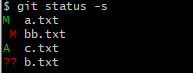

# modified: 被修改过的

（当创建新文件的时候）
# 创建文件   echo "文件里面内容" > 文件名

# git status 显示：
	* Untracked files 未被跟踪的文件  
	
		* 如果想要跟踪新文件
			* 使用 git add `新文件名`
			* 在使用 git  status 显示：	
				* 只要在 Changes to be committed（要提交的更改） 这行下面的，就说明是已暂存状态
				* Changes not staged for commit:(未提交的更改) 即：未放入暂存区
			* 状态概览
				`
				$ git status -s
				 M README  // 修改过的文件前面标记是 M
				MM Rakefile  // 你可能注意到了 M 有两个可以出现的位置，
								出现在右边的 M 表示该文件被修改了但是还没放入暂存区，
								出现在靠左边的 M 表示该文件被修改了并放入了暂存区
				A  lib/git.rb  // 新添加到暂存区的文件前面标记是 A
				M  lib/simplegit.rb // 修改过的文件前面标记是 M
				?? LICENSE.txt  // 新添加的未跟踪文件前面标记是 ??
				`
				
			* 忽略文件
				* 一般我们总会有些文件无需纳入 Git 的管理，也不希望它们总出现在未跟踪文件列表。 通常都是些自动生成的文件，比如日志文件，或者编译过程中创建的临时文件等。 在这种情况下，我们可以创建一个名为 .gitignore 的文件，列出要忽略的文件模式。
				`
				$ cat .gitignore
				*.[oa]
				*~
				`
				第一行告诉 Git 忽略所有以 .o 或 .a 结尾的文件。一般这类对象文件和存档文件都是编译过程中出现的。 第二行告诉 Git 忽略所有以波浪符（~）结尾的文件，许多文本编辑软件（比如 Emacs）都用这样的文件名保存副本。 此外，你可能还需要忽略 log，tmp 或者 pid 目录，以及自动生成的文档等等。 要养成一开始就设置好 .gitignore 文件的习惯，以免将来误提交这类无用的文件。

				文件 .gitignore 的格式规范如下：

				所有空行或者以 ＃ 开头的行都会被 Git 忽略。

				可以使用标准的 glob 模式匹配。

				匹配模式可以以（/）开头防止递归。

				匹配模式可以以（/）结尾指定目录。

				要忽略指定模式以外的文件或目录，可以在模式前加上惊叹号（!）取反。

				所谓的 glob 模式是指 shell 所使用的简化了的正则表达式。 星号（*）匹配零个或多个任意字符；[abc] 匹配任何一个列在方括号中的字符（这个例子要么匹配一个 a，要么匹配一个 b，要么匹配一个 c）；问号（?）只匹配一个任意字符；如果在方括号中使用短划线分隔两个字符，表示所有在这两个字符范围内的都可以匹配（比如 [0-9] 表示匹配所有 0 到 9 的数字）。 使用两个星号（*) 表示匹配任意中间目录，比如`a/**/z` 可以匹配 a/z, a/b/z 或 `a/b/c/z`等。
			* 跳过使用暂存区域
				git commit -am "" 跳过 git add 。
			* 移动文件
				git vm "旧文件名" "新文件名"
				
				
				
			
				
				
				
				
* git分支
	
	oneline 单线图
	
	decorate 装饰
	
	graph 图表
	
	all 全部
	
	项目显示交叉历史 git log --oneline --decorate --graph --all
				
	git checkout -b 分支名称 创建一个分支并切换到此分支			
		* 是下面的简写 （创建分支、切换分支）
		* git branch 分支名称
		* git checkout 支名称
	git branch -d 分支 删除分支
	
	git branch 获取所有分支
	
	git branc
				
				
				
# 问题

* windows使用git时出现：warning: LF will be replaced by CRLF
	$ rm -rf .git  // 删除.git  
	$ git config --global core.autocrlf false  //禁用自动转换
	// 然后重新执行
	$ git init    
	$ git add . 

* 在工程中很容易出现.gitignore并没有忽略掉我们已经添加的文件，那是因为.gitignore对已经追踪(track)的文件是无效的，需要清除缓存，清除缓存后文件将以未追踪的形式出现，这时重新添加(add)并提交(commit)就可以了。
	// 不要忘了后面的 . 
	git rm -r --cached .
	git add .
	git commit -m "comment
	
	